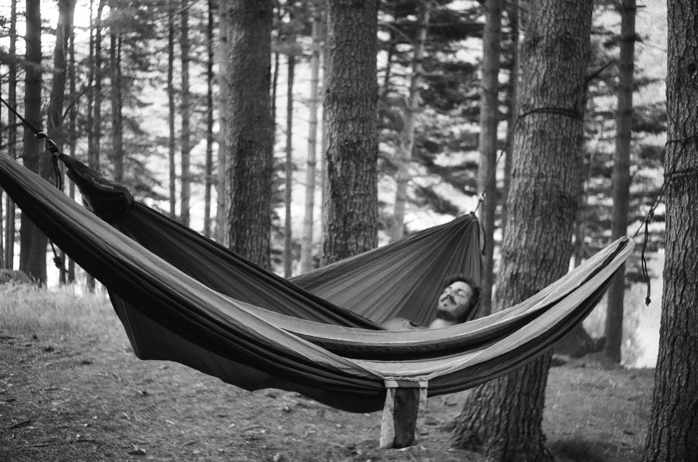
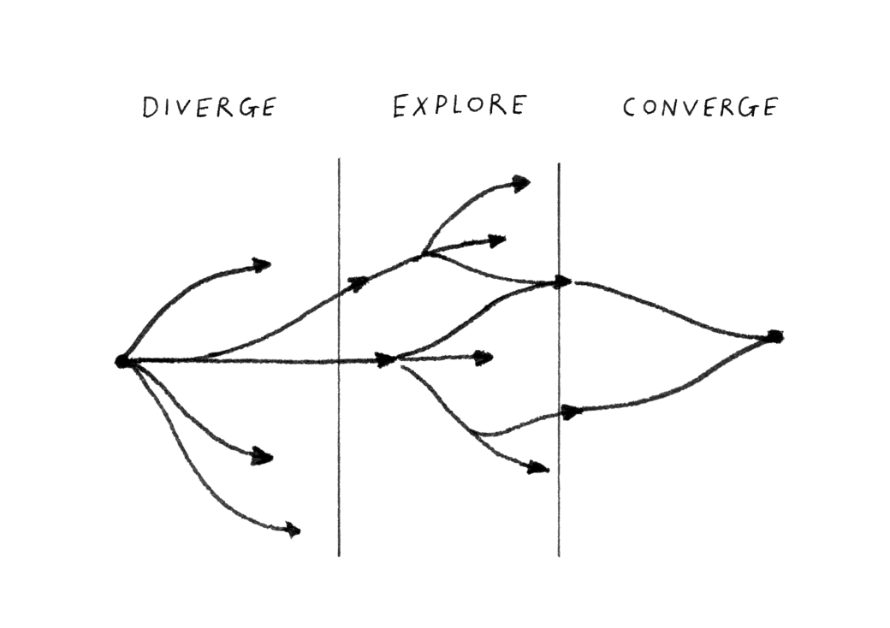

Hello, my name is Antoine Jaunard (1990), I'm a designer from Brussels, Belgium, based in Barcelona, Spain. I design visual identities and interfaces, program web applications, make interactive objects, and teach creativity through code.

## Contact

- [email](mailto:antoine.stuff@pm.me)
- [instagram](https://www.instagram.com/focus.404/)
- [mastodon](https://merveilles.town/@focus404)
- [linkedin](https://www.linkedin.com/in/antoine-jaunard-409aba215/)

## Diverge Explore Converge

Designing something without knowing how to make it has always been a problem for me. Isn't the very art of a great *thing* be thought out all the way to the end? That's how, as a graphic designer with a keen curiosity about how things work, I've extended my knowledge to programming and digital fabrication in order to understand and create the *things* I imagine.

In addition, microorganisms such as bacteria and mycelium fascinate and inspire me, inviting me to develop special tools for their cultivation. But you'll find that out by browsing through my content.

This site aims to represent my practice as a whole. I hope that you will find your way around and discover something new that will arouse your curiosity. And come back from time to time, I still have a lot of content to archive in this very tool, and as you can imagine, I keep on producing more.

