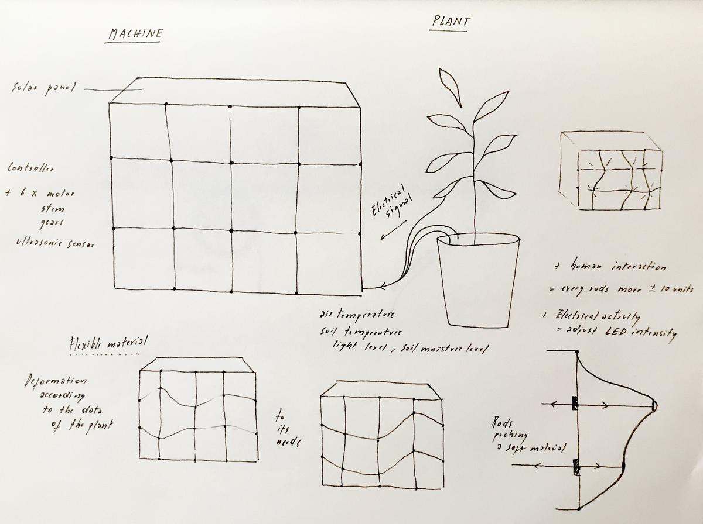
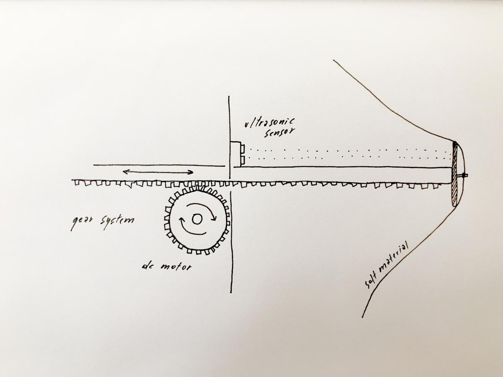
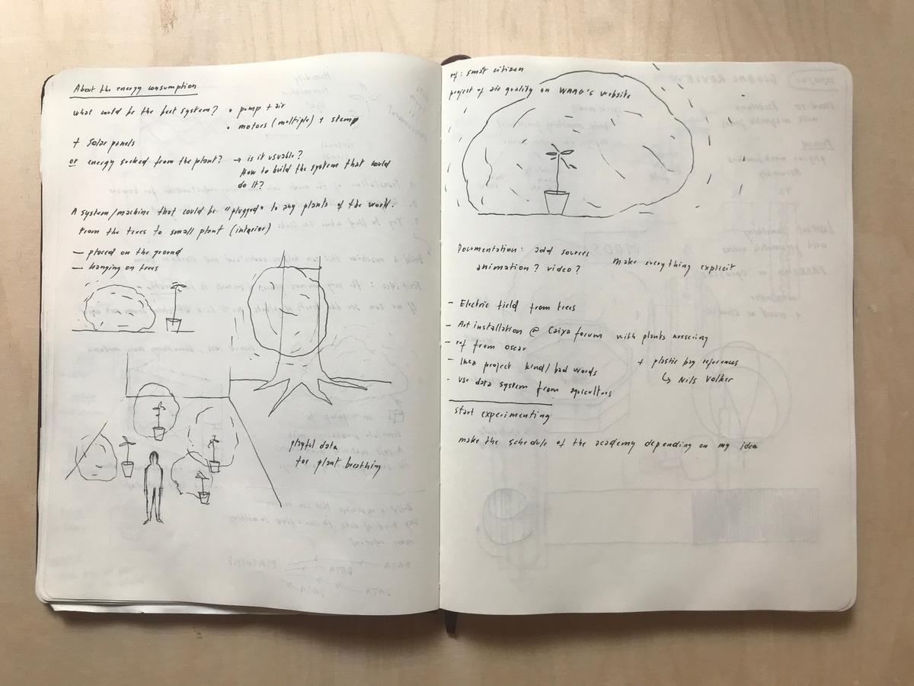
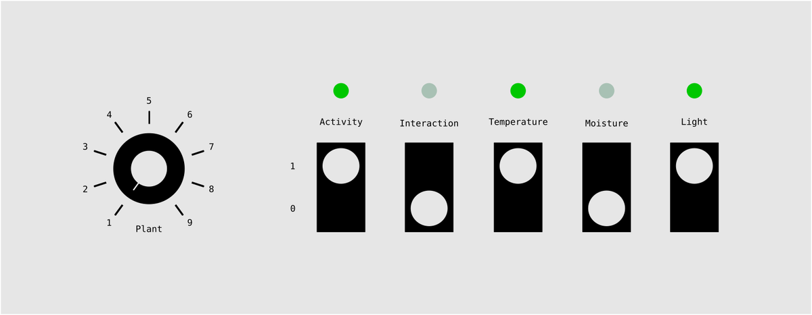

This page is where I collect some of my thoughts on my final project idea.

# Listen to what the plants have to say

Plants communicate as we do. But it's hardly noticeable for us because we don't send and receive signals at the same speed as they do. This is why I would like to build a kind of machine that can help any plant to express its needs at a speed that we can actually perceive and understand. Or should I reformulate in a less human-centric way: a machine that can help humans understand what the plants have to say.

# A machine that helps us understand plants

The machine I have in mind is able to get the data from a plant [temperature, light level, air quality, humidity level, nutrient level, vibrations, ?] and transform it into something visual or audible. The machine itself could be small, like a tool that helps humans understand plants in everyday life, or large, as an art installation that invites the public to join a piece of nature, to watch and listen to what it has to say.

# Breathing

Breathing (or respiration) is a very common process between plants and animals. This is the kind of movement I can use to represent how the plant feels in relation to its environment.

# Data visualization

Before trying to understand what's going on between complex structrures such as plants, a good first step for me is to explore and familiarize myself with the data that I can collect about them and their environement, with the tools we have in fablabs and with the process of digital fabrication. Understand and visualize the needs and activity of plants. Here is my fab academy *masterpiece*, my final project which represents what I learned.

# Mechanical movement

I'm thinking about a machine that can represent the movement of the breath, by using mechanics instead of air, and therefore I can have the control on what's happening, ahd what kind of movement is made.

I imagine a grid of rods pushing into a soft material and therefore deforming it. Each stem is linked to a data type (temperature, moisture level, etc.) and adjust its level depending on the state of the data. The soft material takes a unique shape according to plant's needs.

## Luminous choreography according to the plant's electrical signal

The electrical signal of the plant, collected using electrodes and a signal amplifier, adjust the level of the LED's to give a visual signal on the pulses of the
plants.

## Global reaction to a human touch

If a human touches the plant, the installation reacts as well, inviting the people to give a special attention to it. This can be made using the *touche sensor*, as seen [here](https://www.instructables.com/id/Touche-for-Arduino-Advanced-touch-sensing/).

# Sketches

A kind of "spaceship" for plants. A machine that help them to move according to the light or a animal presence?

Using air pressure instead of mechanics. Get something more organic, less predictable.

Lots of interative elements of differents size. Create a landscape.

An installation that could hang on a tree or be dropped off somewhere. A system,
a network.

Use  of 5 differents sensors: light level, temperature, moisture level sensor,
touche, voltage of the plant.

Each module could represent either one of these activy or a sum of several. A
plant could send its data to one module or to several.

One could compose a
unique installation that invites us to get closer to plants, to observe them, to take care of them.

A module could be assembled with others on a common structure to build a massive
installation. Or a module could be kept apart as a stand-alone piece.

# Respiration

[How and why we measure photosynthesis](https://www.youtube.com/watch?v=PlEzyZadA90)

# Principles

This project convert the data of a plant and its environment into a an installation which aims to invite us to get closer to nature and to observe how plants live and re/act.

## Represent the health and activity of the plant

A portable device collects and analyzes light, air temperature and soil moisture level in a plant's environment, as well as its electrical activity.

These values will allow the device to determine how the plant is feeling, according to its needs and whether it is satisfied or not.

The device mimics the mechanisms and movements of the respiration, because it is a very common process between plants and animals, to represent the health and activity of the plant. For example, a plant that is in a good environment "breathes" slowly and deeply, and a plant that is in danger "breathes" briefly and jerky.

## Interact with the living

A touché sensor, or at least a calibrated capacitive sensor, will allow the device to sense a human-plant interaction and to reveal its nature.

- Is it a caress, a strike or a caring touch?
- What does a plant feels when we touch it?
- What do we feel when we touch them?

## Play with a modular system

A device is composed by two items. One is the `plant`, capturing data, linked to a plant. The other one is the `clone`, showing the health and activity of the plant.

### Data type

- Light level
- Air temperature level
- Soil moisture level
- Plant's electrical activity
- Plant-human interaction

### Communication

On the `plant`, one can choose the communication channel (between 1 and 5) which will be used to send the data to the `clone`.

On the `clone`, one can choose its communication channel and the types of data that are used to represent the health and activity of the plant.

- `plant 01` send `light`, `temperature` and ` interaction` to  `clone 01`
- `plant 02` send `activity` and `moisture` to `clone 02`.
- `plant 03` send `interaction` to `clone 03`

This kind of configuration allows to build any kind of networks, with several plants and tailor-made visualizations. One plant can be linked to several clones, and vice-versa.

### The panel

The panel, a wooden structure designed to assemble modules together, can hosts up to 5 *clones*, creating a more detailed installation that facilitates the understanding of the captured values.

## Public

- Massively used in a large room and re-creating a space forest, it invites an audience to interact with plants and clones
- A device plugged to an houseplant, acting as a companion in the everyday life

## Two possibilities

### Mechanical system

My first idea was to have a mechanical system that pushes rods on a flexible material in order to deform it and give it a unique shape according to the sensations of the plant.

I like this solution because I can easily imagine having total control, mastering the speed / movement ratio of the rods and therefore the shape of the *clone*.

But this solution requires a lot of material to be produced, and it will be too expensive compared to the idea that I have of it. I want to build something as affordable and easy to assemble as possible, to make sure it reaches a large audience.

### Inflatable system

The other system I have in mind uses air pressure to inflate or deflate a flexible bag. This replaces the need for ± 12 motors with a single solenoid and an air pump. The control of the final shape is reduced but also the technical barrier, which is a good point. In addition, the movement should be more organic.

# Materials

My project is made up of three elements: the *plant*, the *clone* and the *panel*.

## The plant

The *plant* is a device connected to a plant. It has sensors and a microcontroller equipped with a WiFi transceiver module. Its role is to sense data from the plant and its environment, process them and send them to the *clone*.

- Microcontroller (ESP32)
- Light sensor
- Temperature sensor
- Soil moisture sensor
- Electrical activity sensor (ADC, Operational amplifier)
- Capacitive sensor
- Power supply
- Enclosure (wood and acrylic)

### References

- [Smart Citizen Docs - Soil sensors](https://docs.smartcitizen.me/Components/Soil/)
- [Chirp! - The plant watering alarm](https://wemakethings.net/chirp/)
- Analog to digital converter (ADC): [AD8605ARTZ-REEL7](https://www.digikey.com/product-detail/en/analog-devices-inc/AD8605ARTZ-REEL7/AD8605ARTZREEL7CT-ND/751314)
- Operational amplifier [AD8605, AD8606, AD86081](https://www.analog.com/media/en/technical-documentation/data-sheets/AD8605_8606_8608.pdf)

## The clone

The *clone* is a device that receives data from the plant and its environment and transforms them into physical movement using an air pump to inflate and deflate a flexible material, creating a movement inspired by our breathing cycle, revealing how the plant feels.

- Air pump
- Solenoid
- Pipes
- Balloon (made out of recycled plastic)
- Cover (made out of flexible fabric)
- Power supply
- Enclosure (wood and acrylic)

### References

- [Blower - Squirrel Cage (12V)](https://www.sparkfun.com/products/11270)

## The panel

The *panel* is a wooden structure that can host up to five *clones* to create a more detailed and unique installation with custom parameters.

- Wood panels
- 3D printed joinery
