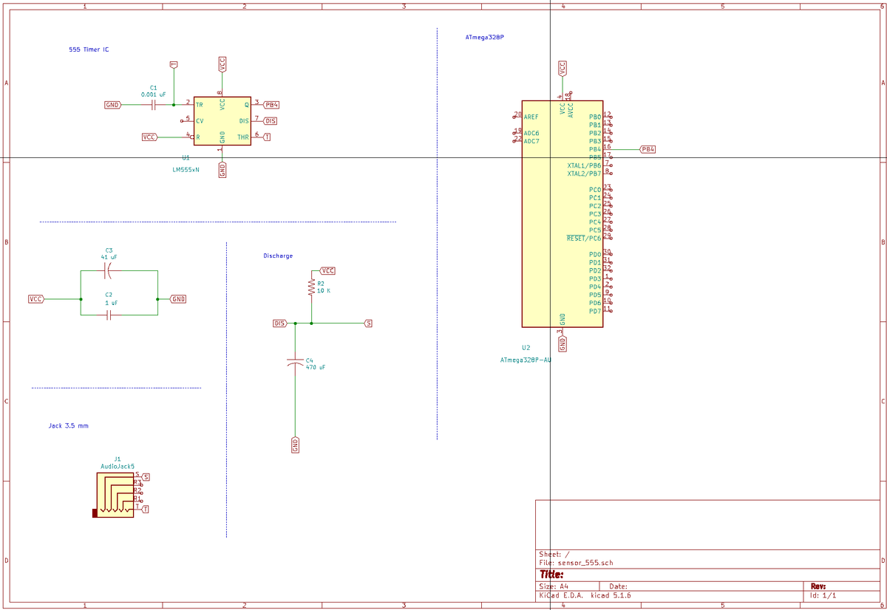
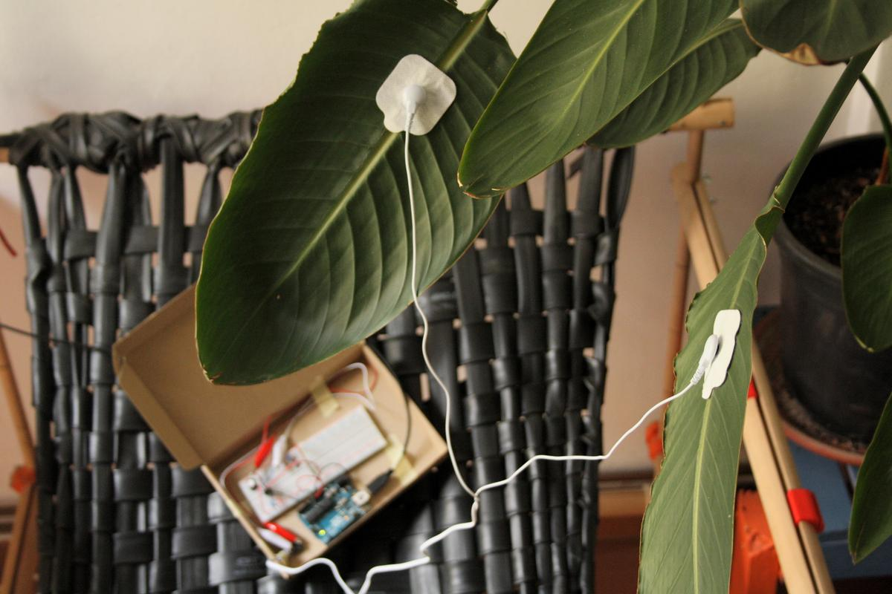
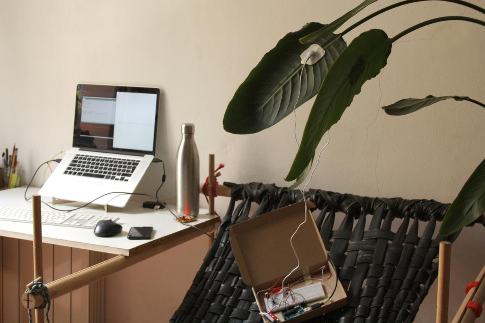

# Introduction

I selected two projects, related to mine, that listen to the electrical activity of plant in order to produce music (or at least sounds). They both are very useful for the understanding, design and fabrication of the sensing part of my project.

# References

The first is [Pulsum Plantae](http://lessnullvoid.cc/content/2011/10/pulsum-plantae/) ([Github project](https://github.com/Lessnullvoid/Pulsum-Plantae)). This project amplifies the low voltage of a plant to make it readable, then converts it into an interactive installation that makes sounds. Leslie Garcia, Thiago Hersan, and Paloma López (the artists) have opened the sources of their project to make it accessible to people like me, allowing me to learn how things work and what could be a technical solution for this specific project.

The other comes from [Data Garden](http://philadelphia.thedelimagazine.com/9336/fyi-on-diys-phl-data-garden) and their [Midi Sprout](https://www.midisprout.com/). Midi Sprout is a device that converts the electrical activity of plants into midi signals that you can send to any device such as synthetizers in order to produce musical melodies made by plants. The project isn't open-source but, fortunately for me, someone ([Sam Cusumano](https://github.com/electricityforprogress)) open-sourced the electronic part of it to make it accessible to all. It can be found [here](https://www.instructables.com/id/Biodata-Sonification/) and [there](https://github.com/electricityforprogress/BiodataSonificationBreadboardKit).

# Sensors

I will prototype them both and compare the results to see which one is best for my use.

## Sensor prototype n°1: 555 IC timer

The first sensor I want to prototype is build around a [555 IC timer](https://en.wikipedia.org/wiki/555_timer_IC). This component works as a square wave generator and the values it gives can be modified by changing the resistance of the circuit.

This sensor is used to graph changes in galvanic response (electrical “skin” conductance/resistance) by producing a square wave of variable frequency and pulse width. The values I get from this custom sensor can help me understand what happens inside the veins of the plant, or at least understand its electrical activity.

Here is the list of the components I used to assemble this sensor:

- 555 Timer
- Capacitor 0.0042uF
- Capacitor 1uF
- Capacitor 47uF
- Resistor 100K
- Jack Input 3.5mm
- Electrode pads
- Electrode lead
- Potentiometer 10k
- 16MHz Crystal Oscillator
- ATmega328P (Arduino Uno, in case of this first prototype)

More information: [List of materials](https://docs.google.com/spreadsheets/d/1nhU3fjO-yuVyLYuE5AC39vmvim1dWyxoJ2PYOr6acvA/edit?usp=sharing)

### From input to output

In order to know if the data I collect from the plants is usable, I first have to do some data treatment. In this case, I have to convert an digital input into something that looks more alive than just `0 1 0 1 1 0`.

The idea of using the 555 IC timer is to measure how often the length of the `1` compared to the `0` and calculate the duty cycle.

<pre>
durationHigh = pulseIn(pinTimer, HIGH);
durationLow = pulseIn(pinTimer, LOW);
dutyCycle = float(durationHigh) / (durationHigh + durationLow) * 100;
</pre>

It gives me a value in percentage that varies according to the conductivity of the plant.

I will elaborate more about this topic on its dedicated page:

[From input to output](button:fabac-finalproject-code-logic.html)

### Alocasia Amazonica

The *Alocasia Amazonica* is one of my favorite plant, sitting on my desk. Its nerves are big and apparent which is supposed to make her a perfect candidate for my experiment.

And the results are way better than what I expected. The plant is *super* reactive to any touch and gives me beautiful data which seems quite easy to manipulate.

- Duty cycle: from ~43% to ~47%
- Reacts when I touch
- Some interferences are perceptible (computer, keyboard) or reactions to stimuli?

### Strelitzia reginae (Birds of Paradise)

The *Strelitzia reginae* and its big leaves is even more reactive than the Alocasia. Small variations in the data I collect are visible, any simple touch anywhere on the plant makes a tiny jump in the curve. I played with it during an hour without getting bored a single second.

- Duty cycle: from ~40% to ~51%
- highly reactive to touch
- the curve oscillate more than with the Alocasia

## Sensor prototype n°2: Op-amps

TODO: Prototype with an Arduino Uno and a breadboard

