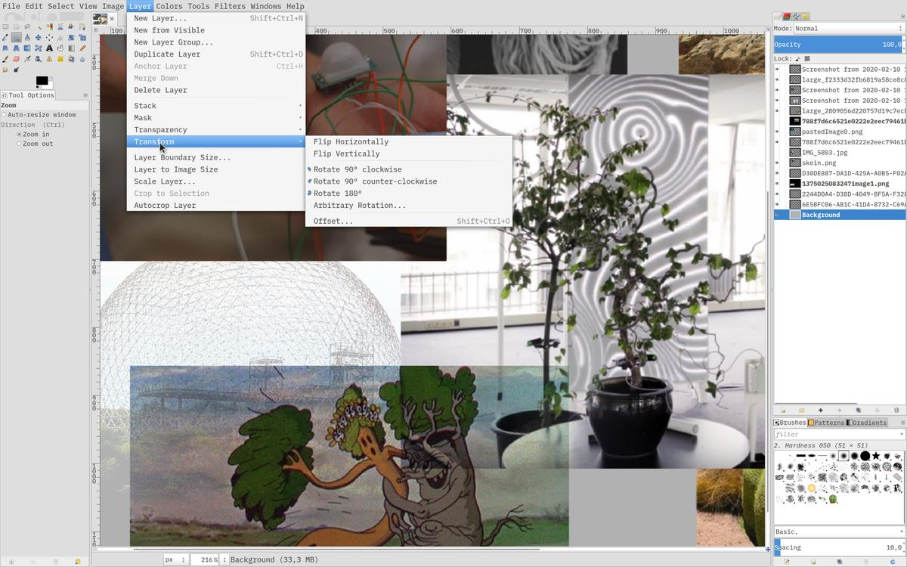
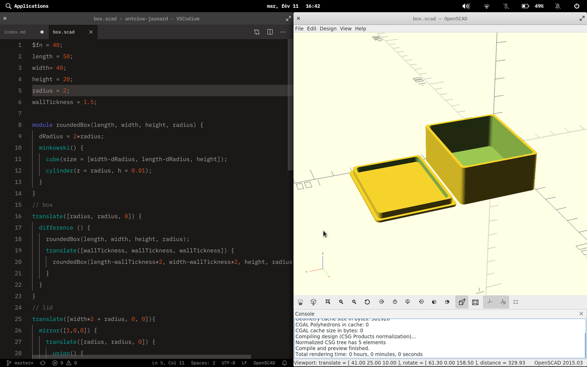
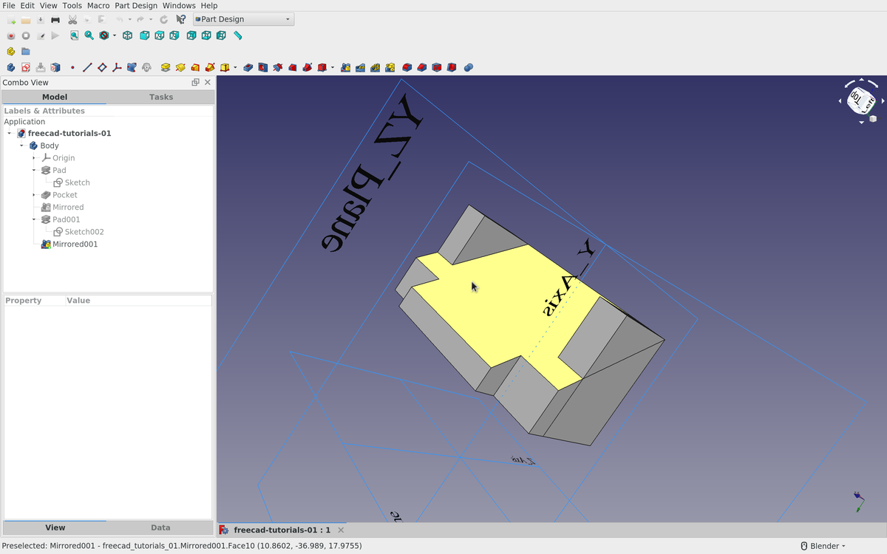

A tour of open-source softwares for computer-aided design, in order to discover and learn some of the tools that I will use to design my future projects.

# GIMP

GIMP is a raster graphics editor used for image retouching and editing, converting between different image formats, free-form drawing, …

`$ sudo apt-get install gimp`

Even if I only used GIMP to draw a quick moodboard for my project, I directly had a good feeling with it, the software seems robust and well designed. There's a huge online community behind it, which makes finding tips and tricks super easy.

File: [references.xcf](https://cloud.antoine.studio/index.php/s/RKRdTDDCXPsSt4t/download?path=%2F02-cad&files=references.xcf)

## Shortcuts

- Move: `m`
- Scale: `shift + t`
- Crop and resize: `shift + c`
- Rotate: `shift + r`

And many more with a "GIMP shortcuts" [research](https://duckduckgo.com/?q=GIMP+shortcuts&t=canonical&atb=v195-1&ia=cheatsheet&iax=1) in DuckDuckGo.

# Inkscape

Inkscape is a vector graphics editor.

`$ sudo apt-get install inkscape`

I used Inkscape to draw a basic but vector schema of my project. I did not have a good experience with this software: I had a few bugs, the software crashed several times, the manipulation of the vectors was not precise. Surely I need to spend more time on it, maybe to tweak it a bit, because the community behind the software seems to agree that it has great potential. Next time, I will try a Python script experiment, an area where Inkscape seems very interesting.

File: [schema.svg](file:schema.svg)

## Shortcuts

- Select: `s`; Node: `n`
- Zoom tool: `z`; Zoom in: `+`; Zoom out: `-`
- Transform: `ctrl + shift + M`
- Ellipse/arc tool: `e`
- Rectangle tool: `r`
- Convert selected object(s) to path: `shift + ctrl + C`
- Bezier tool: `b`
- Calligraphy tool: `c`
- Color picker: `d`

And many more with a "Inkscape shortcuts" [research](https://duckduckgo.com/?q=Inkscape+shortcuts&t=canonical&atb=v195-1&ia=cheatsheet&iax=1) in DuckDuckGo.

# OpenSCAD

OpenSCAD is a software for creating solid 3D CAD (computer-aided design) objects. It is a script-only based modeller that uses its own description language; parts can be previewed, but it cannot be interactively selected or modified by mouse in the 3D view. An OpenSCAD script specifies geometric primitives (such as spheres, boxes, cylinders, etc.) and defines how they are modified and combined (for instance by intersection, difference, envelope combination and Minkowski sums) to render a 3D model.

`$ sudo apt-get install openscad`

I really like the approach of using code to create 3D model. It's parametric by design, everything is always visible in the code (no secret), versioning is possible with GIT, sharing sources is light and easy. Even if writing code can scare some people, I think OpenSCAD remains the most accessible software for modeling 3D objects.

Make sure to always have [this cheatsheet](https://www.openscad.org/cheatsheet/index.html) close to you while writing models.

I used OpenSCAD to design a basic printable box. As you can see in the second image, the modification of certain variables (declared at the top of the document) creates a new box.

And here is the source code:

<pre>
$fn = 40;
length = 50;
width= 40;
height = 20;
radius = 2;
wallTickness = 1.5;

module roundedBox(length, width, height, radius) {
  dRadius = 2*radius;
  minkowski() {
    cube(size = [width-dRadius, length-dRadius, height]);
    cylinder(r = radius, h = 0.01);
  }
}

// box
translate([radius, radius, 0]) {
  difference () {
    roundedBox(length, width, height, radius);
    translate([wallTickness, wallTickness, wallTickness]) {
      roundedBox(length-wallTickness*2, width-wallTickness*2, height, radius);
    }
  }
}

// lid
translate([width*2 + radius, 0, 0]){
  mirror([1,0,0]) {
    translate([radius, radius, 0]) {
      union() {
        roundedBox(length, width, 1, radius);
        difference() {
          translate([wallTickness, wallTickness, 0]) {
            roundedBox(length-wallTickness*2, width-wallTickness*2, 4, radius);
          }
          translate([wallTickness*2, wallTickness*2, 0]) {
            roundedBox(length-wallTickness*4, width-wallTickness*4, 6, radius);
          }
        }
      }
    }
  }
}
</pre>

# FreeCAD

Freecad is general-purpose parametric 3D CAD modeler software made to design real-life objects of any size. It is highly customizable and extensible and it can read and write to many open file formats.

`$ sudo apt-get install freecad`

File: [freecad-test.FCStd](file:freecad-test.FCStd)

FreeCAD seems to have everything we need to design parts and machines, it seems really powerful. The thing that annoys me a little is the interface, I feel it over-complicated and I get lost easily, without knowing what I am doing. Maybe it comes from the fact that I "fell in love" with the "simplicity" of OpenSCAD? Anyway, I will have to use FreeCAD and OpenSCAD together, and I am quite satisfied with all the possibilities it offers.

Each view has a custom set of tools. So it's important to switch to the appropriated view before doing some manipulations. The more useful ones are `Sketcher` and `Part Design`.

# Blender

Blender is 3D computer graphics software used for creating animated films, visual effects, 3D printed models, motion graphics, …

Installation: `$ sudo snap install blender --classic`

Blender is super powerful and can be used in a wide variety of fields. I don't see any real use for me right now, as I mainly focus on exporting models from my computer to the real world, instead of polishing virtual things. However, it will be my weapon of choice for quickly sketching an idea in 3D and animating it if necessary.

File: [setup.blend](file:setup.blend)

## Shortcuts

- Switch between edit and object mode: `tab`
- Switch the preview mode: `z`
- Move: `g`; + the axe if needed `x`, `y`, `z` or multiple ones `xy`
- Select box: `b`; select circle: `c`; select lasso `l`; (un)select all: `a`
- Cut a shape: `ctrl + R`
- In edit mode, switch between the select modes (vertex, edge or face): `1 or 2 or 3`
- Insert faces: `i`

# Conclusion

GIMP and Inkscape will definitely be part of my arsenal for handling bitmaps and
vectors. For 3D modeling, I will try to focus on Freecad, simply because its
spectrum is clearly focused on the modeling of technical parts, like a real CAD
tool. Lately, I have discovered that it is quite easy to use a little openscad
code in Freecad, which seems to combine the best of both worlds. Concerning
Blender, it seems so complete that it scares me a little, let's say that I
prefer the more specific, minimal tools, even if it's great to see an
open-source tool so well developed.
