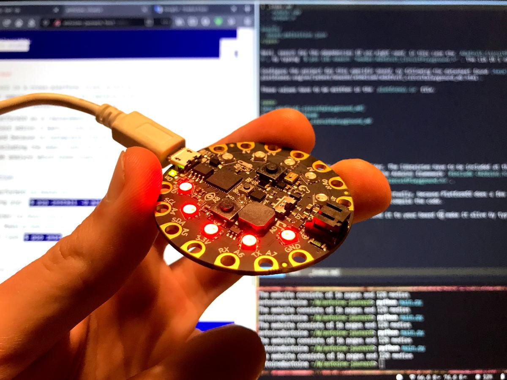

Two weeks ago, I designed a pomodoro timer during the [Electronics design](fabac-assignments-electronics-design.html) week. It's now time to program it. I'm going to write the piece of code that will light my LEDs as time goes by and find a way to send it to the ATtiny1614 chip. I'm going to focus on the latter: how to send a program (= program) a chip. Well, that was the plan.

Unfortunately, in the meantime, the coronavirus has hit Spain (and the whole world). We are now all in quarantine, with no access to the lab. I will have to work from home, with the equipment I already have, nothing more.

For this reason, I'm going to use a [Circuit Playground Express](https://www.adafruit.com/product/3333). This tiny board is already equipped with 10 mini NeoPixels, 1 motion sensor, 1 temperature sensor, 1 sound sensor, 1 mini speaker, 2 push buttons, 1 slide switch, infrared receiver and transmitter and 8 alligator-clip friendly input/output pins. It's a perfect board for quick prototyping and code experiments.

