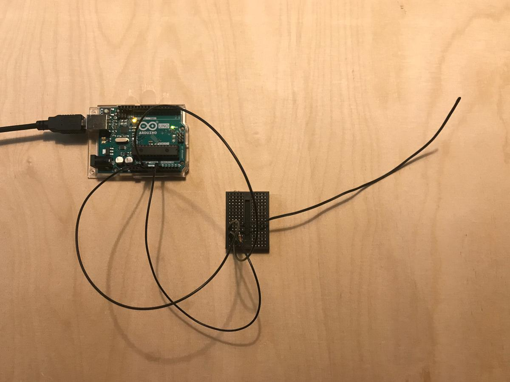
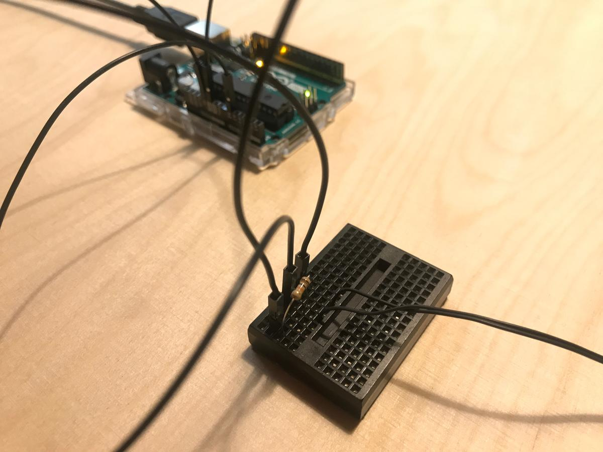

Or how to measure temperature using a resistor.

> To measure the temperature, we need to measure the resistance. However, a microcontroller does not have a resistance-meter built in. Instead, it only has a voltage reader known as a analog-digital-converter. So what we have to do is convert the resistance into a voltage, and we will do that by adding another resistor and connecting them in series. Now you just measure the voltage in the middle, as the resistance changes, the voltage changes too, according to the simple voltage-divider equation. We just need to keep one resistor fixed
> > Analog Voltage Reading Method, [Adafruit](https://learn.adafruit.com/thermistor/using-a-thermistor)

## Connection

The thermistor is linked to the `GND`, and to the analog pin `0` and to the `5V` pin through a 10 resistor.

([image source](https://computers.tutsplus.com/tutorials/how-to-read-temperatures-with-arduino--mac-53714))

## Code

Here is the piece of code that print the value of the analog pin `0` and convert its values into a Celcius temperature value.

<pre>
#include &lt;Arduino.h&gt;
#include &lt;math.h&gt;

void setup()
{
  Serial.begin(9600);
}

// Function that applies the Steinhart-Hart equation
float thermistor(int val)
{
  float temp;
  // From raw analog values
  temp = log(((10240000 / val) - 10000));
  // To Kelvin values
  temp = 1 / (0.001129148 + (0.000234125 + (0.0000000876741 * temp * temp)) * temp);
  // Convert Kelvin to Celsius
  temp = temp - 273.15;
  return temp;
}

void loop()
{
  int val;
  float temp;
  val = analogRead(0);
  temp = thermistor(val);
  Serial.print(temp);
  Serial.println(" °C");
  delay(1000);
}
</pre>

Main resource: [this tutorial](https://computers.tutsplus.com/tutorials/how-to-read-temperatures-with-arduino--mac-53714)
