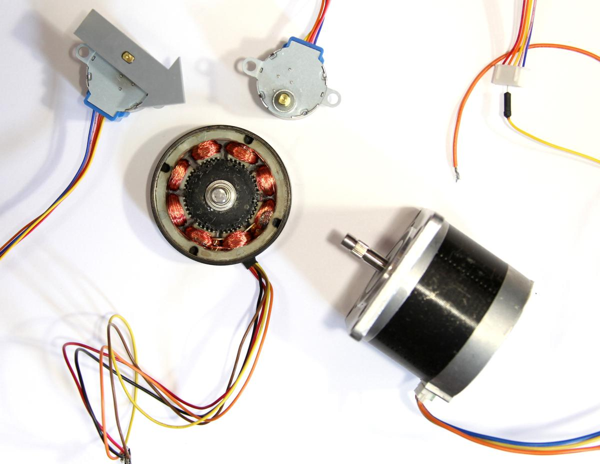
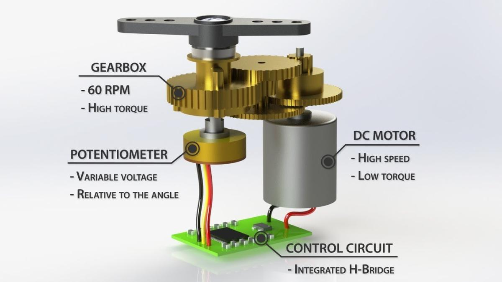

This week's assignement is about output devices: we are learning how to make various motors work, what are their mechanisms and principles, when and why use a specific one instead of another.

I'm going to lend a hand to [Maud Bausier](https://maudb.gitlab.io/dok/), my partner, who is building an incubator to grow mycelium or any fermented food (tempeh, sriracha, etc.). I think we could have enough material to finish a prototype at home (covid-19 restrictions).

The main challenges for the moment concern electronics, which consists of: a thermistor (to know the temperature inside the incubator), a Peltier (to heat it), a fan (to cool it), an LCD screen (to know what's going on) and two push buttons to set the desired temperature inside the incubator.

---

Part of this assignment is also covered on my final project's page.

[The Green Observatory: Output](button:green-observatory-output.html)

---

# Motors

But first, I needed some basics about motors: a motor is mainly made of coils and magnets. When current goes through a coil, a magnetic field is generated around it. The higher the current, the greater the field. This magnetic field creates polarity which is used to create a rotational force. This force is called [the torque](https://en.wikipedia.org/wiki/Torque) and its value depends on the motor's input current. More current implies stronger magnetic field in the coils, that means more attraction/repulsion.

Image source: [ITP Physical Computing](https://itp.nyu.edu/physcomp/lessons/dc-motors/dc-motors-the-basics/)

## DC motor

Maybe the simplest and most common motor in electronics, it converts current electrical energy into mechanical energy. The motor spins in one direction. Switching its polarity changes its direction. Varying the current supplied varies the speed of the motor.

There are two main kinds of DC motor: the brushed one and the brushless one. The first one is more commonly used because it is the cheaper one. The brushless is bit more expensive, but it is less noisy and can last a lot longer because it doesn't need to be maintained, simply because there is almost no friction inside it.

Image source: [Sparkfun: Motors and selecting the right one](https://learn.sparkfun.com/tutorials/motors-and-selecting-the-right-one#what-makes-a-motor-move-)

## Stepper motor

> Stepper motors are different than regular DC motors in that they don’t turn continuously, but move in a series of steps. A stepper motor is a motor that has multiple coils, not just one. By energizing each coil in sequence, you attract the shaft magnets to each coil in the sequence, and you can turn the motor in precise steps, rather than simply rotating continually.

Source: [ITP Physical Computing](https://itp.nyu.edu/physcomp/lessons/dc-motors/dc-motors-the-basics/)

## Servo

> A Servo is a small device that has an output shaft. This shaft can be positioned to specific angular positions by sending the servo a coded signal. As long as the coded signal exists on the input line, the servo will maintain the angular position of the shaft. As the coded signal changes, the angular position of the shaft changes.
>> [Seattle Robotic Society](http://www.seattlerobotics.org/guide/servos.html)

Image source: [How Servo Motors Work & How To Control Servos using Arduino](https://www.youtube.com/watch?v=LXURLvga8bQ)

As we can see on the image above, a servo motor is composed by a DC motor, a potentionmeter and embedded circuit to control them.

Servo motor appears to be the perfect candidate when we need a full control of the rotation angle, direction and speed of a motor.

# MOSFET

A MOSFET (Metal Oxide Semiconductor Field Effect Transistor) is a semiconductor device which is used for switching electronic signals.

TODO: MOSFET description

# LCD screen

TODO: LCD screen description

