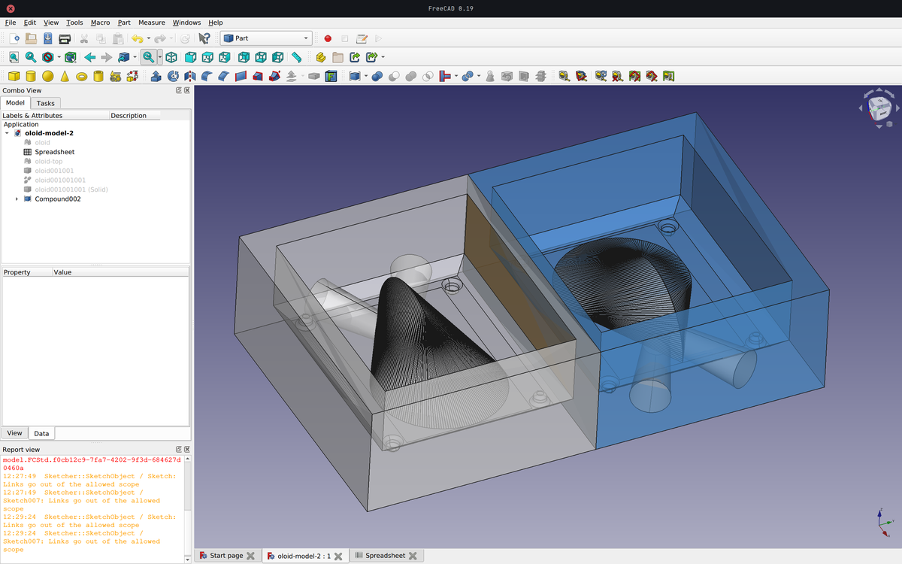
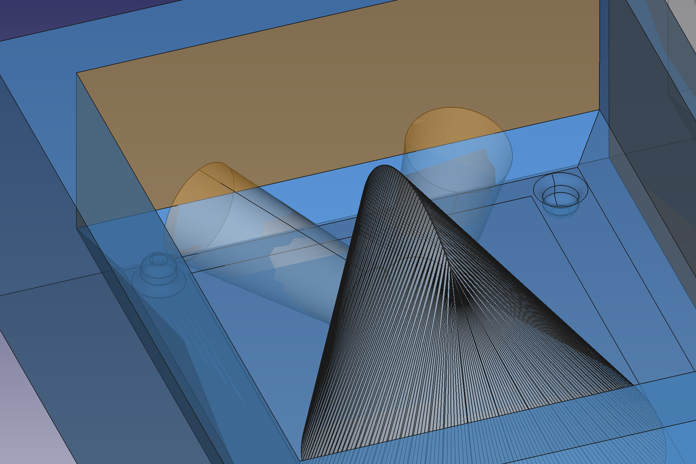
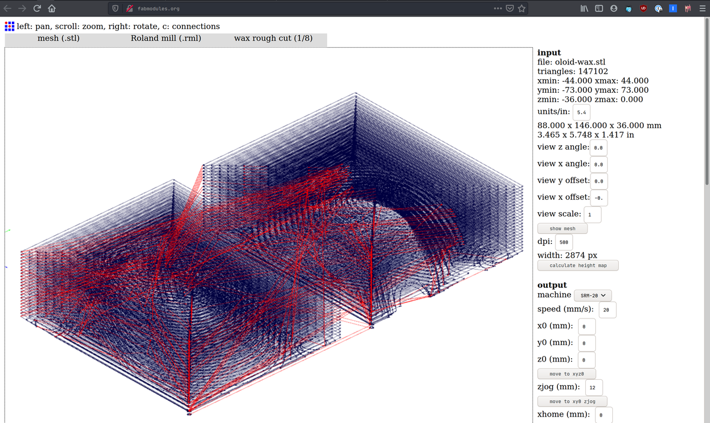
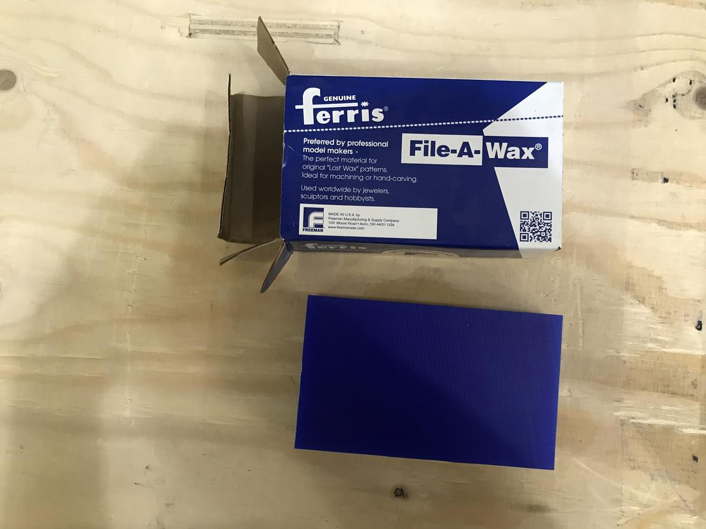
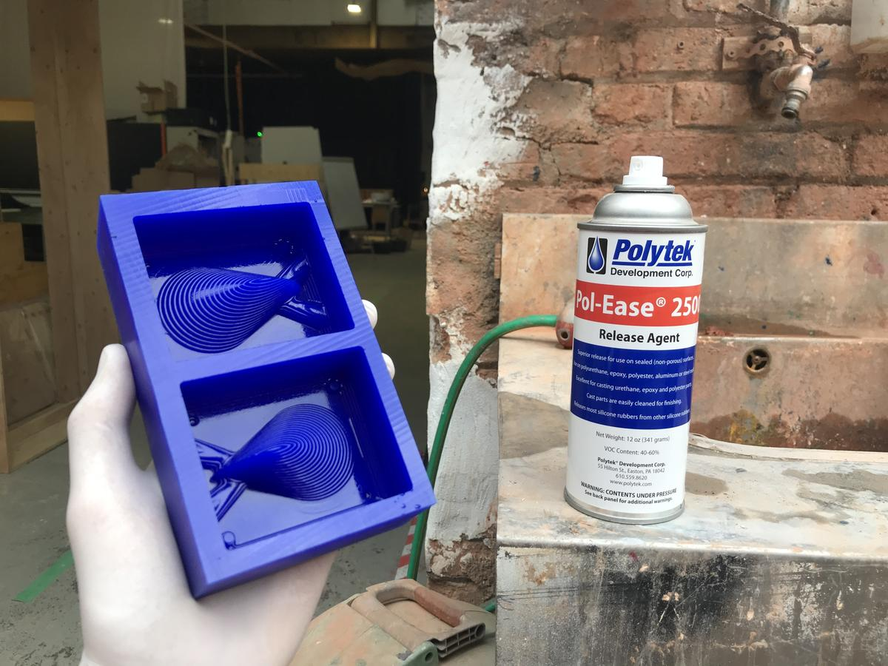
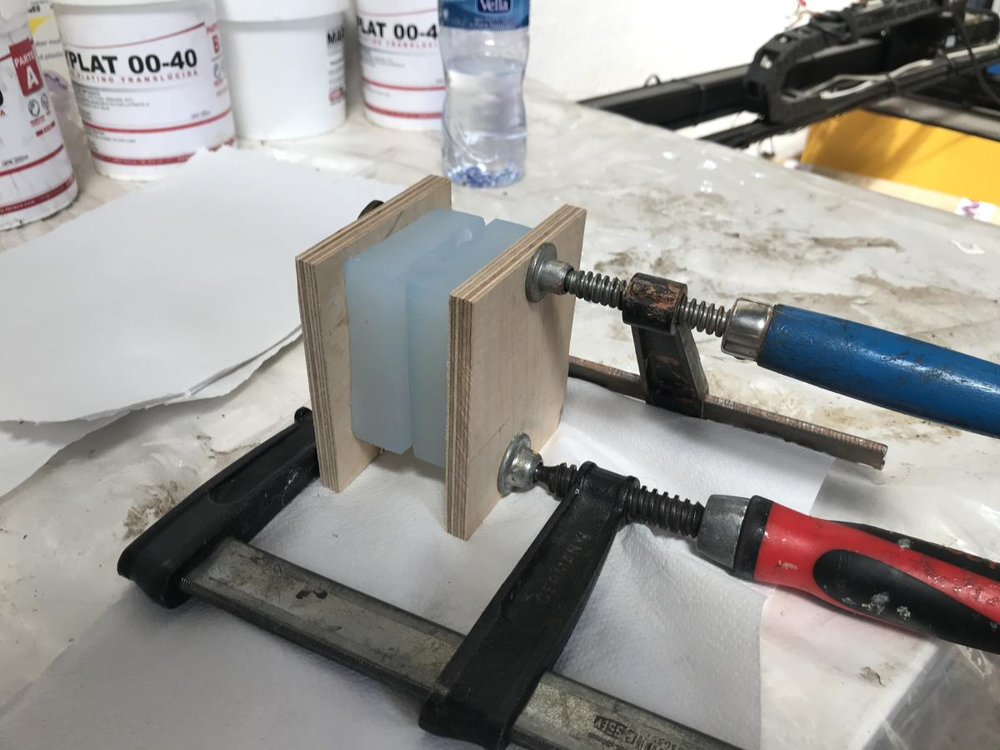
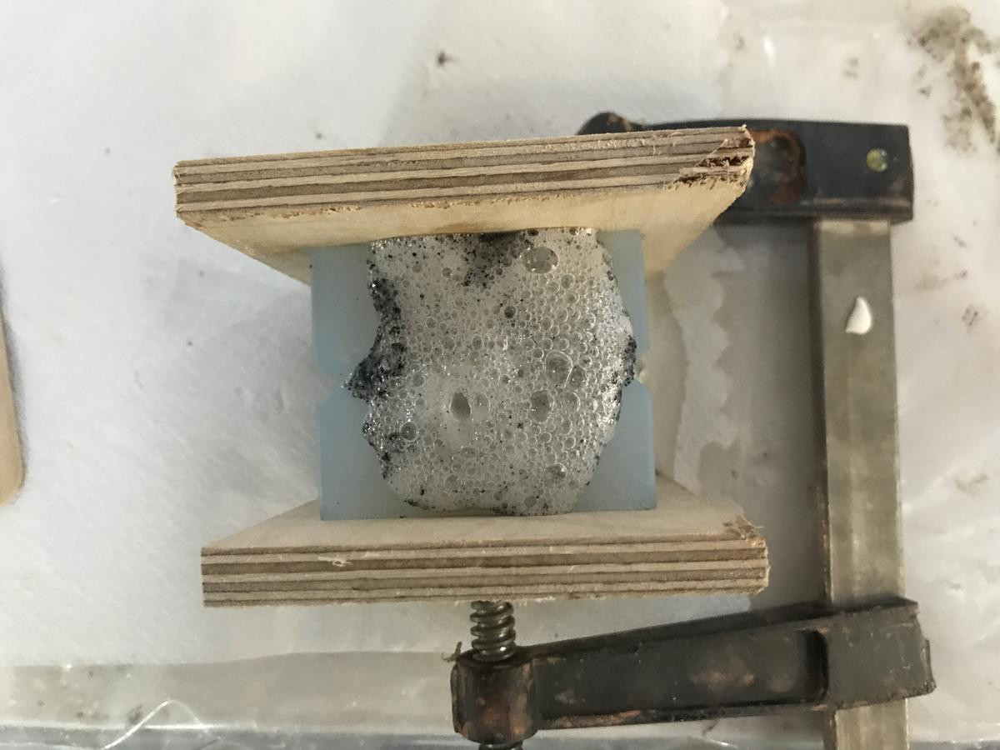
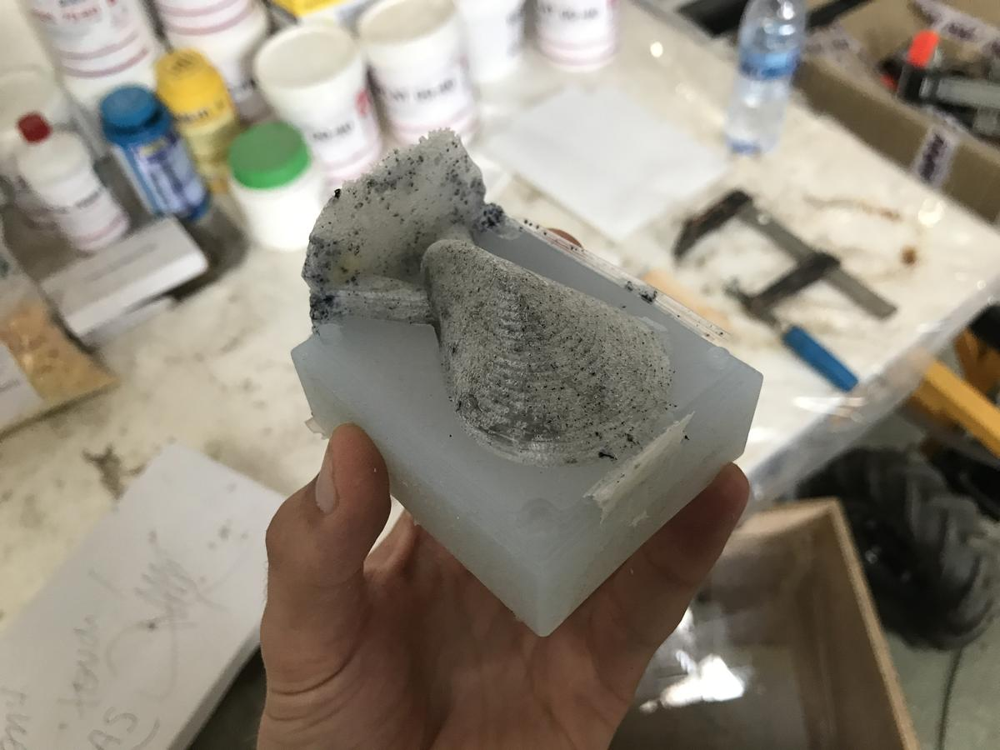
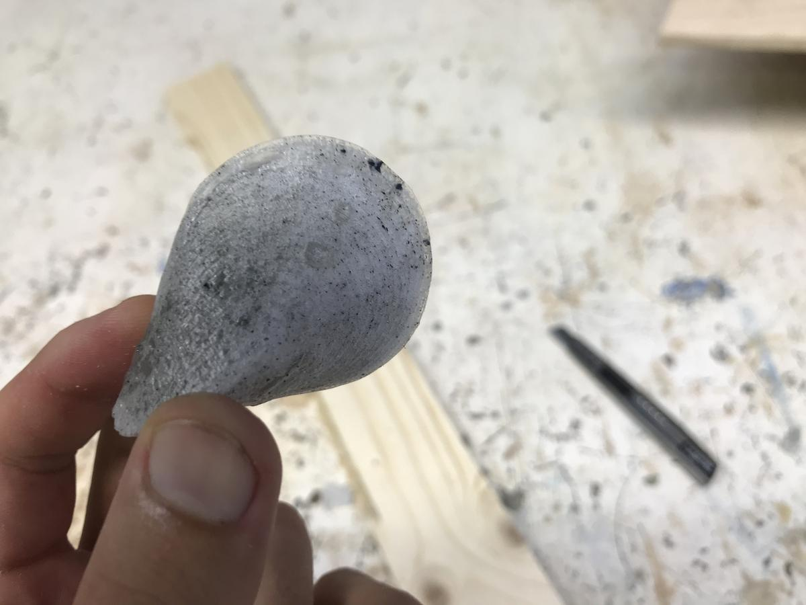

Remember the oloid I printed during the [3D printing](3D-scanning-printing-oloid-shape.html) week?
For this *Molding & Casting* week, I'm going to mold an oloid and to cast it in the variety of materials that we have here, in Fab Lab Barcelona.

# Mold design

The molding and casting workflow consists of:

1. Milling a positive version of the desired object into a block of wax
2. Filling it with silicon to get a negative (and flexible) mold
3. Filling the previously made mold with another type of silicon or resin to get the final (and positive) object.

I'll use the oloid model I already did as a starting point.

The main idea is to model the wax block according to its actual dimensions `88mm * 36mm * 146mm`, make a pocket to host half of the desired object, add guides and pouring holes.

Then, because my oloid is symmetrical and because it fits into the wax block, I could duplicate what I did to make both sides of the mold at the same time. If the wax block had been smaller, I would have milled once and made two molds with the same wax block.

## Guides

I added guides to the model so that I could easily close the two sides together, making sure they are in the perfect position.

## Pouring hole and air flow

I had to add two holes to the model, one to pour the material into the mold and the second to allow the air to escape. Without the second, it would be almost impossible to pour the material into the enclosed space.

## Resources

- [Tutorial](https://www.youtube.com/watch?v=5lwENZeNiNg) on how to modify a `.stl` model in Freecad
- [Tue's documention](http://academany.fabcloud.io/fabacademy/2020/labs/barcelona/students/tue-ngo/assignments/week-15-molding-and-casting.html)

# Generate toolpaths

I'll use the milling machine *Roland monoFab SRM-20* to mill my block of wax.

I generated the `.rml` files using [Fab Modules](http://fabmodules.org/). We have to produce two files, one for the rough cut and the other for the finish cut.

## Global

These are the settings I used to generate the toolpaths.

- input format: `.stl`
- modifiy the units/in to `25.4` and dpi to `500` (to use millimeters instead of inches)
- calculate the height map
- output form: `.rml`
- select the proper process: `wax rough cut` (1/8) or `wax finish cut` (1/8)
- machine: `SRM-20`
- origin: `0,0,0` (x,y,z)
- zjog: `12 mm`
- home: `0,0,12` (x,y,z)
- choose the end mill type, tool diameter, offset overlap, and tool overlap settings for each process (rough of finish cut)
- Calculate
- Save

## Wax rough cut

- tool diameter: `3.175 mm`
- type: `flat end-mill`
- tool overlap: `50%`

## Wax finish cut

- tool diameter: `3.175 mm`
- type: `ball end-mill`
- tool overlap: `90%`

# Fabrication

Now that the files are ready, let's play with this reproduction technique. The first step will be to mill the positive mold, then mold the negative mold from it, to finally be able to cast the oloid shape I designed in various materials.

## Milling the positive mold

The positive mold is made out of a block of wax. The wax is soft enough to allow a high accurancy and can easily be re-used multiple times. 

For this project, I was lucky to start with a brand new block of wax. If that wasn't the case, I would have had to mill the first layer to make sure the block was perfectly flat and the right size.

I used the [MonoFab SRM-20](https://www.rolanddga.com/products/3d/srm-20-small-milling-machine), the same one we use to mill PCB's, to mill the wax. I like how this machine is accurate and reliable in different tasks.

To set properly the X and Y, the center of the endmill has to be exactly on top of the bottom left corner of the block of wax.

<video><source src="milling.mp4"></video>

Milling a block of wax produces a messy environment full of wax flakes. But don't worry, we recover everything at the end of the process to melt it down and transform it into another block of wax. Almost no waste!

The final result is quite impressive. The lines we can see were produced by the rough cut, but the final cut smoothes everything superbly.

## Molding the positive mold

This step consists of making a positive mold using silicon and the previously milled negative mold. The general idea is quite simple: fill the mold with silicon, wait and unmold. Let's now take a detailed look at the different steps.

### About silicon

> Silicon is a chemical element with the symbol Si and atomic number 14. It is a hard, brittle crystalline solid with a blue-grey metallic lustre, and is a tetravalent metalloid and semiconductor.
> > [Wikipedia](https://en.wikipedia.org/wiki/Silicon)

### Knowing the quantity of material required

As we don't want to prepare too much material, silicon in this case, and waste it, it is good practice to measure the volume of our mold in order to prepare the right amount of material. To do this, a simple trick is to fill the mold with water and measure the volume.

### Applying a release agent on the mold

Silicon can stick super well to the wax and become very though to unmold. To avoid this tricky situation, apply a release agent to the mold of wax.

This release agent is a super-thin layer of silicon that will help considerably to unmold the future mass of silicon without damaging it.

Apply it evenly on the clean and dry wax and wait 10 minutes for it to dry.

### Mixing and pouring

The [Easyplat 00-40](https://www.feroca.com/en/platino-adicion/620-easyplat-00-40-silicona-de-platino-para-moldes-.html) silicon is active when the two parts are mixed together.

These two parts must be equal in weight and volume. Their sum must therefore correspond to the previous value we obtained by calculating the volume of the mold with water.

They will begin to dry 30 minutes after they have come into contact with each other. Set an alarm to make sure you don't take longer than you have.

<video><source src="mix-well.mp4"></video>

A good tip for lazy people, fix a wooden stick in a screwdriver to mix the mixture effortlessly.

<video><source src="pouring.mp4"></video>

Pour the silicon slowly and with a stream as thin as possible to avoid creating bubbles. But don't forget that time is limited, you have to find the right balance between quality and speed.

This silicon mix takes between 3 and 6 hours to dry perfectly, depending on the room's temperature. I don't want to take a risk on this part, I let it dry the full night.

### Result

And this is the result! It's as clean as expected, all the little details are there. The process went smoothly, what a pleasure.

# (re)Production

The positive mold produced the negative mold which can now be used to produce positive objects! I'm going to test different materials that are at my disposal at the Fab Lab Barcelona. I will use platinum silicon, pine resin and urethane resin. They seem to have a very different finish from each other. I can't wait to see the result.

## Platinum silicon

The first thing to do is to measure the volume of material needed to fill the mold. Once again, pour water into your mold, as mine is symmetrical, I can do it on one side and multiply the volume obtained by two.

Then prepare the right amount of material. For this platinum silicon, we can do it by weight or by volume. I decided to do it by volume because it requires less calculation, the ratio is 1:1.

As before, the two liquids are activated when they are in contact with each other, check the working time that the mixture allows you and set a timer.

Press the two parts of the mold together to be sure that there is no leak, and that is it, we are ready to pour the silicon into it.

<video><source src="pouring-first-material.mp4"></video>

After a bit more than an hour, the material is supposed to be dry and the mold can be unmold. I always prefer to be careful and count the extra time before demolding, I don't want to lose this long process because of my impatience.

Here is the result. The last step is now to cut the two pipes and sand the piece to obtain a smooth surface.

As you can see, there is a colour change on the upper part. This is because I didn't prepare enough material before pouring it into the mold. I had to quickly remix a small amount of material to pour it before the silicone dried. I thought I had done it quickly enough so as not to mark the final object, but I was wrong. A tiny time difference causes a visible in the final product.

Luckily for my geometry experiment, this has no effect on the volume, the feel is the same all over the surface of the oloid.

### Conclusion

I like the rendering of this platinum silicon. It almost looks like it is made of clay. It's easy to work with, the final result is super smooth and respects all the details the object can have.

## Pine resin

Next on my list of experiments is pine resin. It is a natural material that seems easy to work with. Just melt the resin before pouring it into the mold.

I wasn't sure how much to use, but I soon realised that this variable is not so important with this material. Any surplus will be reusable once the pine resin has dried. The only thing I can lose here is the cooking time.

The pine resin melted in less than 20 minutes. Once it is ready, the next steps are the same as for the previous test material above.

### Conclusion

I really like the result of this pine resin. It is imperfect, fragile, organic. I don't think it meets the expectations that one can have when one thinks of digital fabrication, as a process that can produce the same result over and over again when everything is set up correctly. This material leaves room for an unexpected textured result.

## Urethane resin

My latest experience is with urethane resin. The result produced is supposed to be white/transparent. But I wanted to play with it a bit more, when I mixed the two parts together I added a drop of black pigment without mixing it well to get a kind of marbled effect. It didn't work as expected because of the texture of the material, but at least I know that now, I think it would have worked better with platinum silicon.

The urethane resin began to react within minutes of being poured into the mold. I didn't know what to expect at the time, but the reaction didn't last long, so I didn't have to do anything. I guess this reaction is normal. Phew!

### Conclusion

The bubbles present in the final object make me say that this material needs to be worked with more care, to make sure that the mixture is well made, to pour it very slowly into the mold.

I'm not a big fan of this material, it looks like (or is) a cheap, lightweight plastic. Though I think it can be useful in a context where weight is important. I'm glad to have tested this material, but I don't think I'm going to use it again.

# Final results

## Conclusion

I love making molds and casted objects, playing with these different materials and spending time experimenting with textures. I think this technique has an important role to play in Fab Labs, as we can get well polished results and easily reproduce objects in "mass".

Watch the following video to see the final result and to observe the oloid family rolling strangely :)

<video><source src="final-result.mp4"></video>

# Files

- 3D model > [oloid-model-mold.FCStd](file:oloid-model-mold.FCStd)
- Fabrication file, rought cut > [oloid-wax-rough-3-175-flat.rml](file:oloid-wax-rough-3-175-flat.rml)
- Fabrication file, final cut [oloid-wax-final-3-175-ball.rml](file:oloid-wax-final-3-175-ball.rml)

