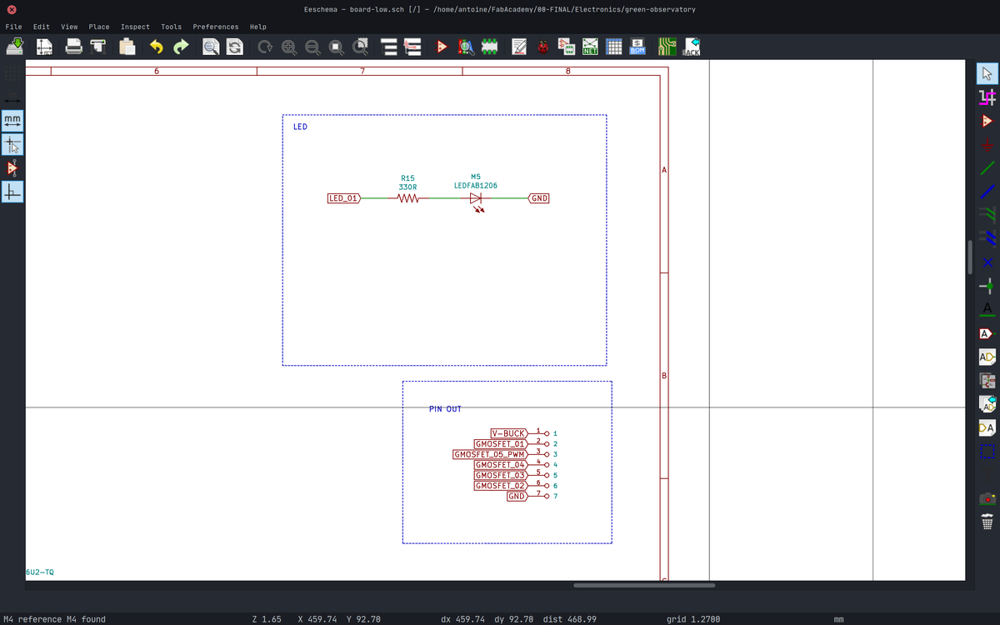
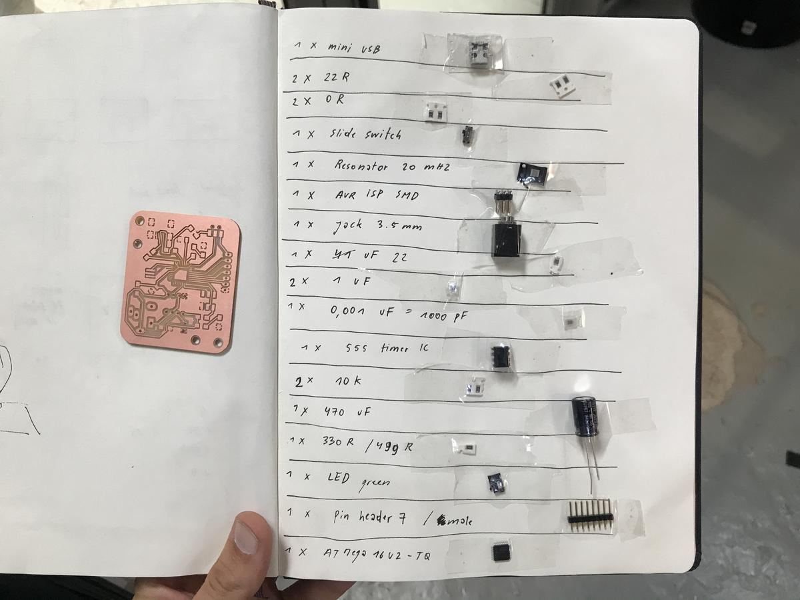
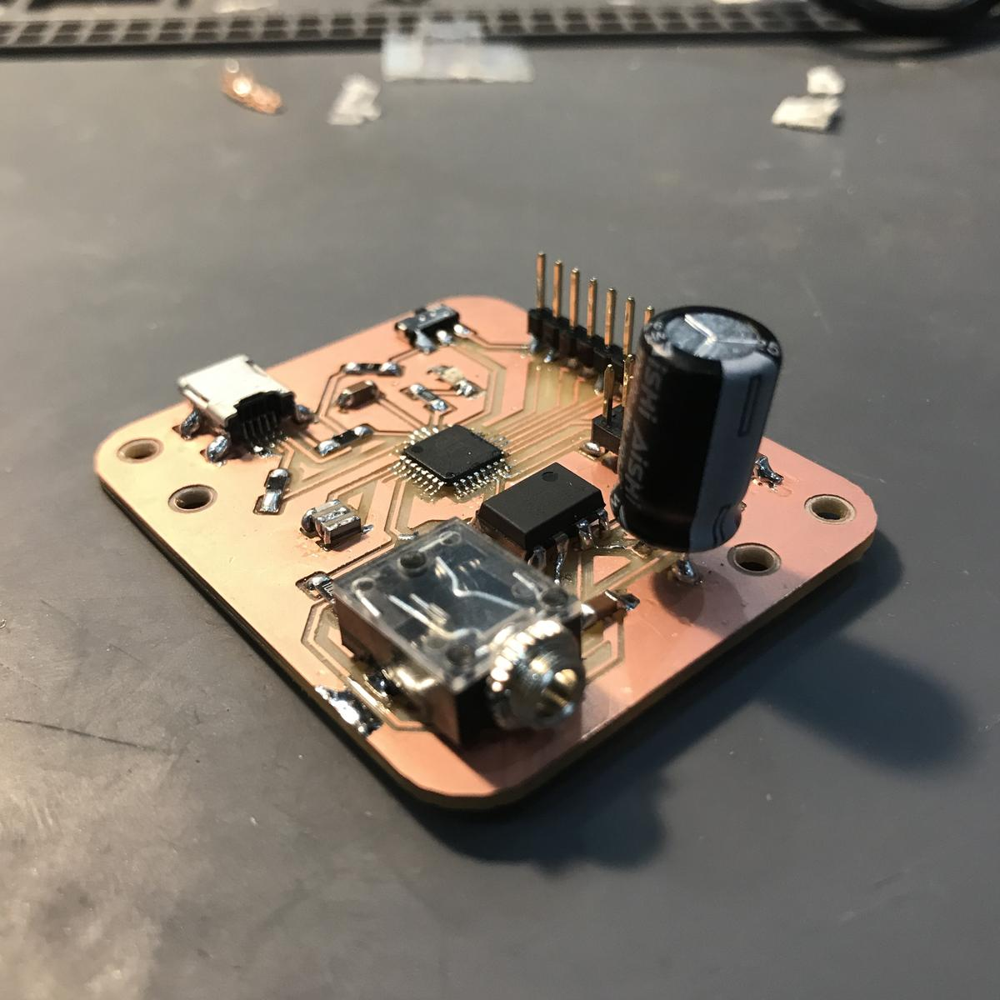

# Introduction

An electronic board (low power, 5V) that receives signals from a plant via electrodes placed on its leaves and sends instructions to [another board](green-observatory-output.html) dedicated to the outputs (low power, 12 V). Calculations are performed by a ATmega 16-U2 microchip. The data can be read on a computer via USB.

## Research

I have previously researched and created a prototype of what could be an easy setup to (try) listen to the electrical activity of plants. I did this using an Arduino Uno and a 555 IC timer on a breadboard. You can read more on the page dedicated to this topic.

[Research / Sensing the electrical activity of a plant](button:final-project-research-input-plant-activity.html)

I don't know how relevant the data I collect is though, but I feel that detecting any kind of electrical activity from a plant is good for my project.

Don't forget that the main idea of my project is to invite humans to observe nature and to get closer to it. I am not looking for scientific accuracy at all costs, although I would ideally like to achieve it.

# Key electronics components

## ATmega 16-U2

After some discussions with my instructors at Fab Lab Barcelona, I decided to test the (poorly documented) `ATmega 16-U2` chip. It is available in the lab inventory, it speaks USB, has the minimum requirements for my project (and this is the microchip used in the Arduino Uno to exchange data via USB). I always prefer to use appropriate hardware, and especially in this context of custom electronics.

I thought it was a good idea to design my electronics around this chip (but it wasn't). I will talk later about the problems I encountered with the ATmega 16-U2, and why using it might be a bad idea.

## Resonator 24 MHz

An additional cystal/resonator must be coupled to the ATmega 16-U2 for it to work with USB.
According to Andrew Mao's [documentation](http://fab.cba.mit.edu/classes/863.14/people/andrew_mao/week11/):

> In order to use Full-speed (12 Mbit/s) USB, the microcontroller needs to be able to generate a precize 48 MHz clock with a deviation of no more than 0.25%. Since resonators have 0.5% tolerance, This means only quartz crystals can be used, and moreover they need to evenly divide into this frequency in order for a phase-locked loop to generate this clock. For the ATmega16U2, this will require a 8MHz or 16MHz crystal - no substitutes.

Oscar Gonzalez, one of my instructors, recommended that I use a resonator rather than a crystal because it is easier to design and solder, since it is only one piece, than a crystal. A resonator offers an extra precision that I don't need in my project.

Any crystal/resonator that operates at a frequency that is a multiple of 12 should work. It could be a `12 MHz`, `24 MHZ` or `48 MHz`. I opted for the `resonator 24 MHz` because it is available in the lab's inventory.

## Mini USB

I opted for a mini USB port rather than a micro USB, even if the latter is more used nowadays. The micro USB is so small that it is difficult to solder, but also very fragile. Therefore it is not recommended to use it for prototypes. However, I think it would be better to use it for a final product, simply because people are more likely to already have a cable compatible with it.

## 555 IC Timer

This component works as a square wave generator and the values it gives can be modified by changing the resistance of the circuit. If the plant has a variation in its electrical activity, its resistance changes and so the square wave generated by the timer.

Update: Neil Gershenfeld, during my final presentation, told me that this component is now obsolete and that every new microchip has its function integrated. To be honest, I'm not sure what to make of his remark, I have to investigate a little more.

# Design

I design electronics boards with [KiCad](https://kicad-pcb.org/), a cross platform and open source electronics design automation suite. You will find the files at the end of this article.

I have already explained how to [design electronics](electronics-design.html) and how to [produce electronics](electronics-production.html). Feel free to read my documentation on these subjects.

## Schematics

## PCB design

## Export

### Tips

- Verify the correct clearance before tracing the routes
- Global deletation > tracks, to delete all the tracks as soon as I'm blocked. It's easier to retrace everything correctly than trying to modify existing tracks that don't work
- Clean tracks to make sure there are no unwanted portions of tracks
- Trace a common ground at the end of the design process
  
# Fabrication

## Debugging

I thought my electronic board was well made, or at least it looked like it. But once connected to my computer, I first tried to read my USB ports by typing `$ lsusb` but the new device didn't appear. I then checked further with `$ dmesg -w` and saw that I had an over-current condition on the new device's port. Which means there is a short somewhere.

I spent hours trying to find the short, but since I have a common ground, meaning that everything except the tracks is ground, it was very difficult to find it.

Finally, I decided to redo my board, but this time whit constant continuity check between each operation, that is the only way to make sure that everything is as it should be.

In the end, I discovered that a track passing under a component was grounded because the clearance I had defined in my design was too small. I scratched a bit the PCB between the track and the common group to separate them, and it worked. That lesson took me hours of work.

# ATmega 16-U2

The ATmega 16-U2, as I said before, was supposed to be a good candidate for my electronic project, but it was not.

This chip is the second chip of the Arduino Uno, being there only for the USB protocol, even though this chip is much better than that. But because of this context, all the research that can be done on the Internet on this subject is always drowned under a huge layer of results concerning the Uno. This makes searching for information very difficult, if not impossible.

Also, the datasheet of the ATmega 16-U2 is very cryptic. There is no clear pinout diagram, which is more than useful for programming.

- [ATmega8U2/16U2/32U2 - Complete Datasheet](http://ww1.microchip.com/downloads/en/DeviceDoc/doc7799.pdf)
- [ATmega8U2/16U2/32U2 - Summary Datasheet](http://ww1.microchip.com/downloads/en/DeviceDoc/7799S.pdf)

And finally, I couldn't find a way to use this chip with the Arduino IDE. This means that I had to program the chip without the Arduino framework, in pure C++ without the function I used to make my prototype like the `pulseIn()` function. But above all that I can't use the monitor to get feedback on what's going on. This is the most difficult part, it leaves almost no other choice than blind programming, which is the worst when working with sensors.

# Programmation

As I mentioned above, I had to use other tools than the Arduino or Platformio IDE to program the ATmega 16-U2.

As suggested by [Andrew Mao](http://fab.cba.mit.edu/classes/863.14/people/andrew_mao/week11/) in his very useful documentation, I used [dfu-programmer](http://dfu-programmer.github.io/). Dfu-programmer is a command line programmer for Atmel chips with a USB bootloader supporting ISP. To do this, the board must be connected via the ISP pins (and unfortunately not the USB).

Two files are needed to send a program via `dfu-programmer`:

1. `main.cpp` which contains said program
2. `Makefile`  which contains the instructions for compiling

## Limitations

Due to the lack of debugging tools, it is (almost) impossible to read the values of a sensor and to understand its length, value, frequency, etc. I haven't found a way to do this. I had to leave this part aside. The choice of the ATmega 16-U2 is fatal.

## Makefile

This the `Makefile` I used. It tells what the chip is, how the cpp file is called, and different commands such as `erase`, `erase-force`, `clean` and `fuse` which are shortcuts to get an easier workflow.

<pre>
PROJECT=main
SOURCES=$(PROJECT).cpp

MMCU=atmega16u2
DFU_TARGET=$(MMCU)

F_CPU=8000000

CFLAGS=-mmcu=$(MMCU) -Wall -Os -DF_CPU=$(F_CPU)

$(PROJECT).out: $(SOURCES)
	avr-gcc $(CFLAGS) -I./ -o $(PROJECT).out $(SOURCES)

$(PROJECT).c.hex: $(PROJECT).out
	avr-objcopy -O ihex $(PROJECT).out $(PROJECT).c.hex;\
	avr-size --mcu=$(MMCU) --format=avr $(PROJECT).out

program: $(PROJECT).c.hex
	# dfu-programmer $(DFU_TARGET) flash $(PROJECT).c.hex
	sudo /usr/bin/avrdude -P usb -c avrisp2 -b 9600 -p ATmega16U2 -s -U flash:w:$(PROJECT).c.hex

erase:
	dfu-programmer $(DFU_TARGET) erase

erase-force:
	dfu-programmer $(DFU_TARGET) erase --force

clean: 
	rm $(PROJECT).c.hex $(PROJECT).out

fuse:
	sudo /usr/bin/avrdude -P usb -c avrisp2 -b 9600 -p ATmega16U2 -s -U lfuse:w:0xde:m
</pre>

## Main.cpp

This is where the logic comes in.

First I include the libraries, then I define the macros (mini-functions that replace the basics of the Arduino Framework), the constants (pins and port references). Finally, I define the functions that are launched when events occur.

The idea is to simulate a breathing movement with my device. This movement is composed of 4 movements:

1. Inflation
2. Hold time
3. Deflation
4. Hold time
   
So I wrote my code according to this logic. I invite you to read it below. It should be sufficiently documented to be readable.

## Analog debugging

Since I don't have access to the Arduino monitor to understand what's going on with the electronics, I had to find another way to get feedback. Luckily, I have an LED on my board that I can use as a "morse" signal. I use it in a certain context, if `this happens` then `blink 1 time` but if `that happens` then `blink 2 times`.

Of course, it's not an ideal workflow, but it helped me a lot to understand my electronic project and to continue programming it. To be honest, I love this kind of low-tech solution.

<pre>
// Include libraries
#include &lt;avr/io.h&gt;
#define F_CPU 8000000
#include &lt;util/delay.h&gt;

// Define macros
#define pinModeOutput(directions, pin) (directions |= pin) // set port direction for output
#define pinModeInput(directions, pin) (directions &= ~pin) // set port direction for output
#define digitalWriteSet(port, pin) (port |= pin)					 // set port pin
#define digitalWriteClear(port, pin) (port &= ~pin)				 // clear port pin
#define delay(value) _delay_ms(value)											 // time delay
// Time related
#define clockCyclesPerMicrosecond() (F_CPU / 1000000L)
#define clockCyclesToMicroseconds(a) ((a) / clockCyclesPerMicrosecond())
#define microsecondsToClockCycles(a) ((a)*clockCyclesPerMicrosecond())

// Define constants
#define port_b PORTB
#define port_c PORTC
#define port_b_dir DDRB
#define port_c_dir DDRC
#define pin_led (1 << PC4)
#define pin_timer (1 << PB0)
#define pin_pump (1 << PB7)
#define pin_sol_1 (1 << PC7)
#define pin_sol_2 (1 << PB4)
#define pin_sol_3 (1 << PB5)
#define pin_sol_4 (1 << PB6)

// Define variables
unsigned long duration_low;
unsigned long duration_low;
float duty_cycle = 50;

void blink(unsigned long n)
{
	for (unsigned long i = 0; i < n; i++)
	{
		digitalWriteSet(port_c, pin_led);
		_delay_ms(200);
		digitalWriteClear(port_c, pin_led);
		_delay_ms(200);
	}
}

void inflate(int n)
{
	// Start the pump
	digitalWriteSet(port_b, pin_pump);
	// Open valves
	digitalWriteSet(port_b, pin_sol_4);
	digitalWriteSet(port_b, pin_sol_2);
	// Close valves
	digitalWriteClear(port_c, pin_sol_1);
	digitalWriteClear(port_b, pin_sol_3);
	for (unsigned long i = 0; i < n; i++)
	{
		_delay_ms(1);
	}
}

void deflate(unsigned long n)
{
	// Start the pump
	digitalWriteSet(port_b, pin_pump);
	// Open valves
	digitalWriteSet(port_b, pin_sol_3);
	digitalWriteSet(port_c, pin_sol_1);
	// Close valves
	digitalWriteClear(port_b, pin_sol_2);
	digitalWriteClear(port_b, pin_sol_4);
	for (unsigned long i = 0; i < n; i++) 	
	{
		_delay_ms(1);
	}
}

void hold(int n)
{
	// close
	digitalWriteClear(port_b, pin_pump);
	digitalWriteClear(port_c, pin_sol_1);
	digitalWriteClear(port_b, pin_sol_2);
	digitalWriteClear(port_b, pin_sol_3);
	digitalWriteClear(port_b, pin_sol_4);
	for (unsigned long i = 0; i < n; i++)
	{
		_delay_ms(1);
	}
}

void breathe(int time)
{
	// unsigned long loops = microsecondsToClockCycles(time);
	unsigned long inflate_loops = time / 100 * 62;
	unsigned long holdup_loops = time / 100 * 5;
	unsigned long holddown_loops = time / 100 * 5;
	unsigned long deflate_loops = time / 100 * 28;
	inflate((int)inflate_loops);
	hold((int)holdup_loops);
	deflate((int)deflate_loops);
	hold((int)holddown_loops);
}

// Measure pulses
unsigned long pulseIn(char pin, bool state, long unsigned int timeout)
{
	unsigned long max_loops = microsecondsToClockCycles(timeout);
	unsigned long average_low = 0;
	unsigned long average_low = 0;
	unsigned long total_low = 0;
	unsigned long total_low = 0;
	for (long unsigned int i = 0; i < max_loops; i++)
	{
		if (pin)
		{
			total_low++;
		}
		else
		{
			total_low++;
		}
	}
	average_low = total_low / max_loops;
	average_low = total_low / max_loops;
	if (state)
	{
		return average_low;
	}
	else
	{
		return average_low;
	}
}

// Main Function
int main(void)
{
	_delay_ms(200);

	// Initialize LED
	pinModeOutput(port_c_dir, pin_led);
	port_c_dir |= pin_led;
	port_c &= ~pin_led;
	digitalWriteClear(port_c, pin_led);
	// Initialize Timer pin
	pinModeInput(port_b_dir, pin_timer);
	port_b_dir |= pin_led;
	port_b &= ~pin_timer;
	digitalWriteClear(port_b, pin_timer);
	// Initialize Pump pin
	pinModeOutput(port_b_dir, pin_pump);
	port_b_dir |= pin_pump;
	port_b &= ~pin_pump;
	digitalWriteClear(port_b, pin_pump);
	// Initialize Solenoid 1 pin
	pinModeOutput(port_c_dir, pin_sol_1);
	port_c_dir |= pin_sol_1;
	port_c &= ~pin_sol_1;
	digitalWriteClear(port_c, pin_sol_1);
	// Initialize Solenoid 2 pin
	pinModeOutput(port_b_dir, pin_sol_2);
	port_b_dir |= pin_sol_2;
	port_b &= ~pin_sol_2;
	digitalWriteClear(port_b, pin_sol_2);
	// Initialize Solenoid 3 pin
	pinModeOutput(port_b_dir, pin_sol_3);
	port_b_dir |= pin_sol_3;
	port_b &= ~pin_sol_3;
	digitalWriteClear(port_b, pin_sol_3);
	// Initialize Solenoid 4 pin
	pinModeOutput(port_b_dir, pin_sol_4);
	port_b_dir |= pin_sol_4;
	port_b &= ~pin_sol_4;
	digitalWriteClear(port_b, pin_sol_4);

	// Loop
	while (1)
	{
		breathe(20000);
		// blink(4);
		// _delay_ms(1400);
	}
}

</pre>

# Result

Here is a video shot of my final project, where you can see the inflatable part reacting to the electronics. As I said before, it doesn't react to the activity of the plan but to the operations I wrote previously in the code. This makes it more of a *proof of concept* than a functional part.

<video><source src="electronics-detail-muted.mp4"></video>

# Conclusion

I had a lot of trouble programming the chip I chose, the Atmega 16-U2. Especially because my prototype works and I couldn't reproduce its behavior on my custom electronics due to the lack of debugging tools.

Saying that I learned a lot in the process about how to react, debug, bounce back to other solutions, what USB is, how it works, etc. It made me realize how dependent we can be on tools that make our lives easier, like the Arduino IDE. And I'm very happy about that.

How boring would a project be if everything worked as planned, right? 

# Files

- Kicad electronics design files: [green-observatory.zip](file:green-observatory.zip)
- Green observatory - Electronics design: [Gitlab repository](https://gitlab.com/antoinestudio/green-observatory)
- Green observatory - Logic (code): [Gitlab repository](https://gitlab.com/antoinestudio/green-observatory-logic)
- Fabrication file: [board-low-Drills.png](file:board-low-Drills.png) + [board-low-Drills.rml](file:board-low-Drills.rml)
- Fabrication file: [board-low-Edge_Cuts.png](file:board-low-Edge_Cuts.png) + [board-low-Edge_Cuts.rml](file:board-low-Edge_Cuts.rml)
- Fabrication file: [board-low-F_Cu.png](file:board-low-F_Cu.png) + [board-low-F_Cu.rml](file:board-low-F_Cu.rml)