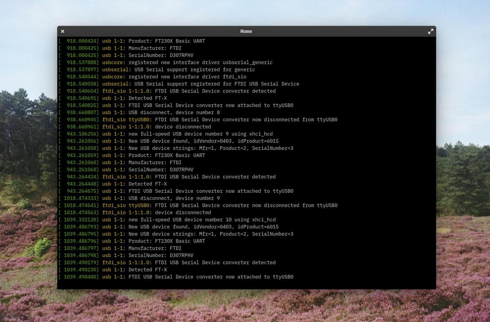

> In-system programming (ISP), also called in-circuit serial programming (ICSP), is the ability of some programmable logic devices, microcontrollers, and other embedded devices to be programmed while installed in a complete system, rather than requiring the chip to be programmed prior to installing it into the system.
> > [In-circuit programming, Wikipedia.](https://en.wikipedia.org/wiki/In-system_programming)

## FTDI & UPDI

I decided to make an [FTDI](https://www.ftdichip.com/) USB-FT230XS-serial. I have to admit that my choice isn't clear at this point. I could have chosen to make another model of programmer, any of them. It's almost impossible to make a thoughtful choice now because I don't know yet what kind of electronic architecture I will need later. Let's say that the most important thing now is learning how to create a programmer, any of them, and to be able to do it again later with a more specific electronic project.

To program this FTDI USB-FT230XS-serial chip, I also need a UPDI (Unified Program and Debugging Interface) which is an interface for programming and debugging other devices, such as the FTDI that I use.

### Files preparation

We always need two differents files to mill a board, one for the traces and one for the outline, because these two tasks need differents end-mills: a 1/32 for the outline and a 1/64 (wich is super fragile) for the traces.

- Import the PNG in [Fabmodules](http://fabmodules.org/)
- Output:`Roland mill (.rml)`
- Process for the traces: `PCB traces (1/64)`
- Process for the outline: `PCB outline (1/32)`
- Machine: `SRM-20`
- Speed (mm/s): `4`
- x0, y0, z0: `0, 0, 0`
- zjog (mm): `12`
- Direction: `climb` or `conventional`  (`climb` is preferred by default)
- `Calculate` & `Save`

I used the same settings for both mills, except for the mill value, as stated,
`1/64` or `1/32`.

TODO: Update values, the 1/32 mill needs to cut at 0.5mm/s speed as is cutting much more material at once

#### Files

- [FTDI traces](files/USB-FT230XS-serial.traces.png)
- [FTDI outline](files/USB-FT230XS-serial.interior.png)
- [UPDI traces](files/FTDI-UPDI.traces.png)
- [UPDI outline](files/FTDI-UPDI.interior.png)

### Milling process

At Fab Lab Barcelona, we use a Roland [SRM-20 Compact Milling Machine](https://www.rolanddga.com/products/3d/srm-20-small-milling-machine/features) to mill PCBs. The machine is compact (as its name suggests) and *very* precise.

Cover the back of the PCB with double-sided tape to make it stick to the surface of the milling machine, we don't want it to move. Don't overlap the layers of tape, this would create different levels and therefore a lack of precision on the Z axis.

Place the PCB inside the milling machine, on the board (parallel to the edge is better, as it is easier to optimize the space on the PCB) and mount the drill on the machine. A 1/32 for the outline or a 1/64 for the traces.

Configure the X and Y axes according to the size of the design and the space available on the PCB.And then, configure the Z axis. This is one of the most *important* part of the milling processs. The end-mill is supposed to be placed perfectly on the surface of the PCB so the machine knows how deep it can go when milling the paths. If not, it will either damage the board or not mill it enough.

To set the Z axis correctly:

1. Screw the end-mill at an approximate height first
2. Move the tool to the X/Y origin while being sure the tool is high enough to not scratch the surface when moving it and press the `Set origin point: X/Y` button
3. Unscrew the end-mill and let it descend slowly until it touches the PCB
4. Press the `Set origin point: Z` button
5. Run the spindle and see if the PCB surface is being milled by the end-mill
6. If it doesn't, set the `Cursor Step` to `x1` (to operate carefully) and go down one step at a time until you reach the PCB surface
7. `Set origin point: Z` again with the updated position

Take care to always lift the Z axis before moving on the X and Y axis. If not, the end-mill will scratch the surface and destroy the PCB.

When the end mill and the XYZ axes are configured, press the `cut` button to load the appropriate file, then press the `setup` button to start the milling process.

<video><source src="milling-process.mp4"></video>

In resume, it's needed to run the cut two times. First time for the traces, using the 1/64 end-mill. Then a second time for the outline using the 1/32 end-mill. It implies that you will have to change the file and the end-mill at the middle of the milling process. Don't modify the X/Y axes by doing it or you will lose the exact position of your design. Only re-setup the Z axis when the 1/32 end-mill is in the machine.

<video><source src="milling-process-2.mp4"></video>

As you can see on the video above, I teamed up with [Tue](https://fabacademy.org/2020/labs/barcelona/students/tue-ngo/), [Marco](https://fabacademy.org/2020/labs/barcelona/students/marco-cataffo/) and [Roger](https://fabacademy.org/2020/labs/barcelona/students/roger-anguera/) in order to save time and materials. Machines are always super busy around here in Fab Lab Barcelona.

We had some issues during the process:

- The first time we milled our boards, the Z axis wasn't defined correctly and some un-milled parts remained on the PCB after the process. It's easy to spot them, they are shiny compare to the rest. We had to re-mill with a slightly different Z axis value, to mill a little deeper.
- We forgot to lift the tool on the Z axis before moving it to the X/Y origin… We scratched the board and we had to re-mill to damaged parts.

It is a good practice to test the board with a multimeter between to milling and the soldering, to be sure that the circuits conduct the electricity as they should.

## Soldering components

> Soldering is a process in which two or more items are joined together by melting and putting a filler metal (solder) into the joint, the filler metal having a lower melting point than the adjoining metal.
> > [Soldering, Wikipedia.](https://en.wikipedia.org/wiki/Soldering)

Once I had the board ready, I could start the soldering process. But before that, I first start the collect the components I needed and sticked them to a sheet of paper to be sure not to lose them.

To solder electronics components on a board, it is easier to start with the central parts to the external parts and from the most complex to the simplest.

The first few minutes of soldering are a bit frustrating, the parts are very small and precision is not easy on this scale. And we have to begin with the most complex part (to get it done before continuing). But once I got used to it, it became a very pleasant moment of mindfulness.

Unfortunately, I forgot to take pictures during the soldering process, I was totally into it, I guess. [This tutorial](https://www.youtube.com/watch?v=QKbJxytERvg) helped me understand how to do.

Here are the results of the two boards, the FTDI and the UPDI.

## Testing the device

The next step was to connect the FTDI board to my computer to see if it was properly mounted and readable.

It wasn't directly the case, I first had some connectivity errors, my computer could recognize a new USB device but didn't know what it was. I had to test the connectivity of all the parts with a multimeter. After a few minutes of testing, I noticed that a resistor was not well soldered… I heated the soldering tool again and fixed the issue.

Another test with the multimeter confirmed to me that the board was well done. Let's plug it to my computer to get that confirmation.

On linux, in order to list the devices plugged to your computer, run `lsusb` in a terminal. Or run `dmesg -w` to get info in real time.

> dmesg (diagnostic message) is a command on most Unix-like operating systems that prints the message buffer of the kernel. The output of this command typically contains the messages produced by the device drivers.
> > [dmesg, Wikipedia](https://en.wikipedia.org/wiki/Dmesg)

