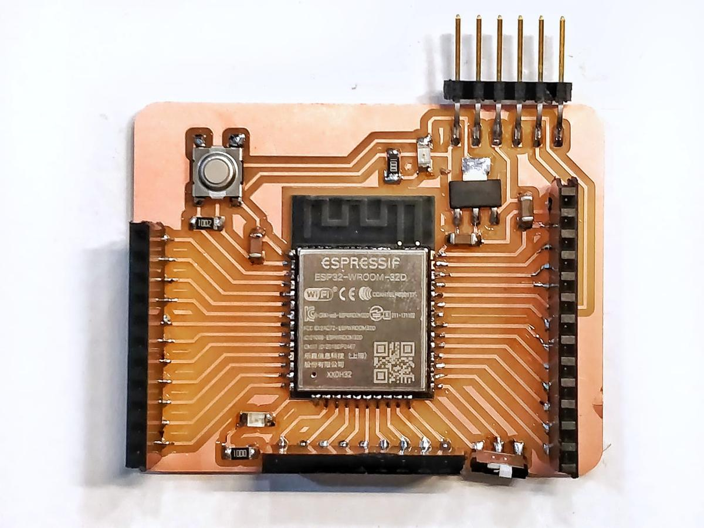

We have been asked to assemble a Barduino few hours before the lab lockdown due to the coronavirus, in order to be able to experiment with it later at home.

> Barduino 2.0 started as a project to have a ESP32 fabacademy compatible board to help the students develope their work on top of it. This board was designed by Eduardo Chamorro Martin with the help of Josep Marti and Oscar Gonzalez in Fab Lab Barcelona 2020.
>> [Barduino 2.0, Gitlab](https://gitlab.fabcloud.org/barcelonaworkshops/barduino-2.0)

To use that board with PlatformIO, `pio init` a new project specifically for the ESP32 chip.

`$ pio project init --board esp32-devkitlipo`

This command generates the `platformio.ini` files with the desired values.

<pre>
[env:esp32-devkitlipo]
platform = espressif32
board = esp32-devkitlipo
framework = arduino
</pre>

## Pinout

Then, as we can see on the datasheet, the ID of the programmable test LED is `13`. We can use it to test if our board and our configuration work properly.

## Programmer slider switch

Also, there is a *Programmer Slider Switch* that changes the behaviour of the chip and tells it wheter it's in programming mode or execution mode. Obviously, we have to turn it to the left, the programming mode, before uploading our program.

## Blink program

Using PIN 13, as seen above.

<pre>
 #include <Arduino.h>

 int led_in = 13;

 void setup() {
   pinMode(led_in, OUTPUT);
 }

 void loop() {
   digitalWrite(led_in, HIGH);
   delay(1000);
   digitalWrite(led_in, LOW);
   delay(1000);
 }
</pre>

Turn the programming slider switch to the right, in execution mode, press the reset button and the test LED should blink. Olé.