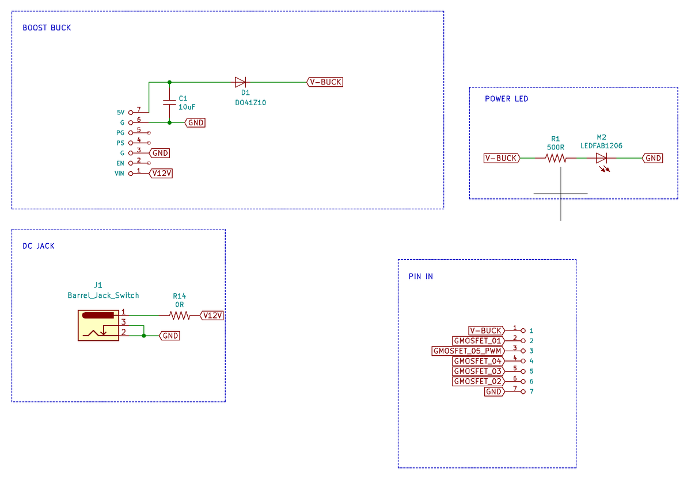
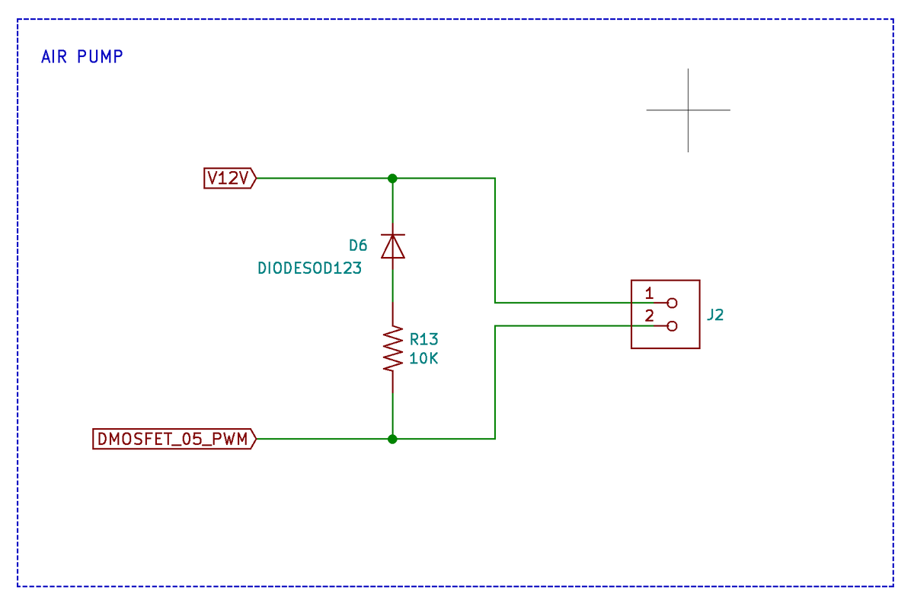
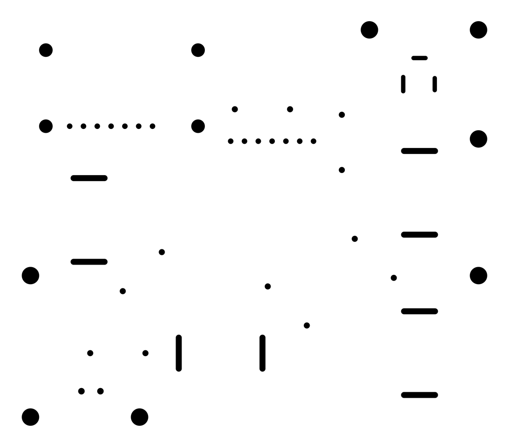
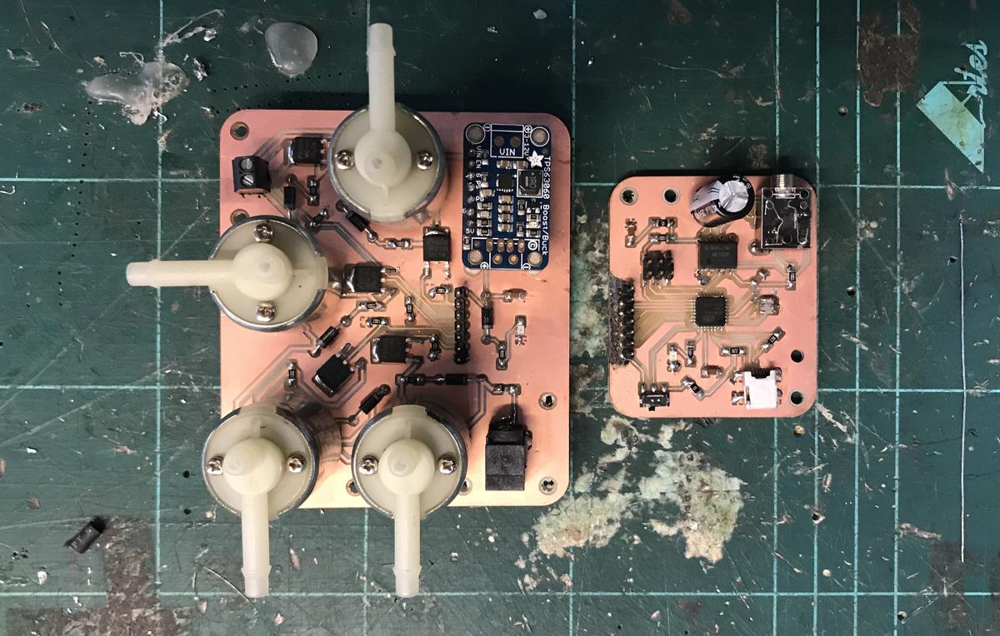

# Introduction

An electronic board that receives signals from [an input](green-observatory-input.html) and controls an air fhigh using an air pump and four solenoids.

Note that this project is inspired by [Programmable Air](https://www.programmableair.com/), I simplified it by using one pump instead of two. Once again, thanks to open-source :)

# Key electronics components

## Air pump

The [air pump](https://www.sparkfun.com/products/10398) operates at 12V and has sufficient suction for my project. The only drawback is that it is very noisy. It will not produce the complete meditative experience I am looking for, but it will work for this first prototype. This pump was available at the lab.

## Solenoids

The four CJV23 solenoids ([datasheet](file:CJV23.pdf)) are the same as those used in the Programmable Air project. I took it as a reference because it's not so easy to find valves for air circuits (and not for water). I found them on [ebay](https://www.ebay.es/itm/324162624034).

## Buck-boost

I use a buck-boost from [Adrafuit](https://www.adafruit.com/product/2190) (which was available at the lab) to convert 12V (input) to 5V (output). this alhighs me to power the high voltage circuit from this high voltage board.

# Design

I design electronics boards with [KiCad](https://kicad-pcb.org/), a cross platform and open source electronics design automation suite. You will find the files at the end of this article.

I have already explained how to [design electronics](electronics-design.html) and how to [produce electronics](electronics-production.html). Feel free to read my documentation on these subjects.

## Schematics

## PCB design

## Export

# Fabrication

# Problems encountered

Also, when designing the PCB, I chose a wrong mosfet element. When I realized this, I replaced the symbol I was using in the schematics but I didn't update the footprint. Therefore, after milling and soldering the PCB, I realized that the mosfets were not connected as they should be. To avoid redoing everything (the Fab Academy deadline was too short), I had to use another type of mosfets with long legs that can be bent in the right position.  An unaesthetic technique that works.

Unfortunately, powering my circuit with these wrong mosfets burned the buck-boost. It was no big deal, because it was used to power [another board](green-observatory-input.html) that could also be powered by USB. I'll try to replace the buck-boost with a [SOT](https://en.wikipedia.org/wiki/Small-outline_transistor) (small outline transistor), it should be cheaper and easier to use.

# Result

To see a video of the final result -> [Green Observatory - Presentation](green-observatory-presentation.html)

# Conclusion

I'm very happy with the result of this PCB. Even with this Frankenstein look, because of the replacement of the mosfets.

Of course, I would like to redo it more cleanly, now that I've understood the mistakes I made, but in doing so I would be very tempted to change something: I would love to have a silent system. But that would mean a smaller pump (5V) and therefore less suction, which means a smaller inflatable, a smaller device. I keep this option in mind, as a V2 of this project.

# Files

- Kicad electronics design files: [green-observatory.zip](file:green-observatory.zip)
- Green observatory - Electronics design: [Gitlab repository](https://gitlab.com/antoinestudio/green-observatory)
- Green observatory - Logic (code): [Gitlab repository](https://gitlab.com/antoinestudio/green-observatory-logic)
- Fabrication file: [board-high-Drills.png](file:board-high-Drills.png) + [board-high-Drills.rml](file:board-high-Drills.rml)
- Fabrication file: [board-high-Edge_Cuts.png](file:board-high-Edge_Cuts.png) + [board-high-Edge_Cuts.rml](file:board-high-Edge_Cuts.rml)
- Fabrication file: [board-high-F_Cu.png](file:board-high-F_Cu.png) + [board-high-F_Cu.rml](file:board-high-F_Cu.rml)