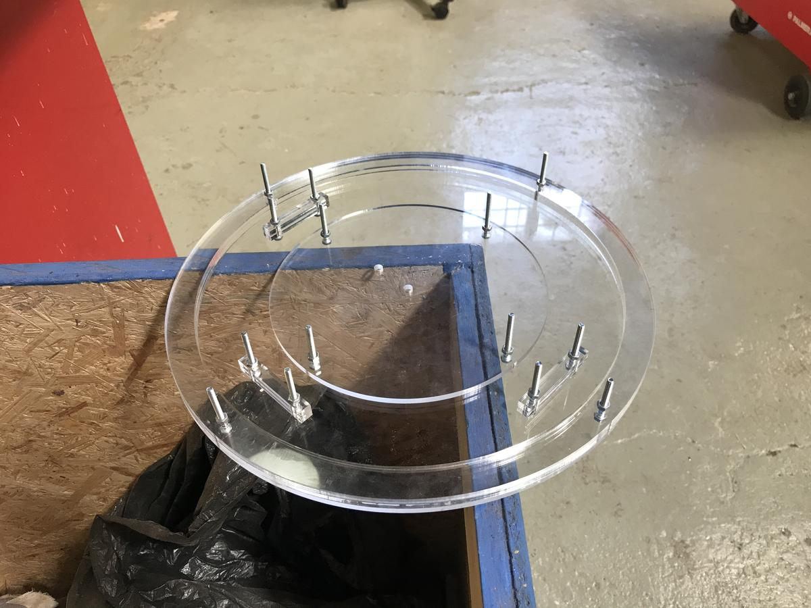
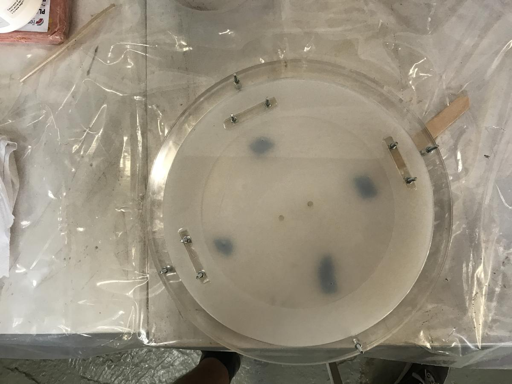

An important part of my final project is the inflatable part, which will help us understand the electrical activity of plants. This part should produce organic movements that react to a flow of air.

So I have to produce a silicone part that has an air pocket inside that could be inflated and deflated by pushing and pulling a flow of air inside through two pipes (in and out).

# Strategy

The strategy that Eduardo Chamorro (one of my instructors) and I came up with is to build a mold using a piece of laser-cut acrylic to cast a first layer of silicon and then redo another layer while inserting another piece of acrylic that will allow us to preserve an air pocket inside the cast silicon piece.

- Design a structure that can be lasercutted
- Plan which parts will be added and/or removed during the casting process
- Keep in mind how the air will circulate

# Design

I designed the mold using Freecad and parametric values. The shape of this inflatable part is given by the overall [structure](green-observatory-structure.html).

# Fabrication

## Lasercutting

The cutting of the `5 mm` thick acrylic sheet was very fast. Indeed, nothing fancy here, only cuts.

### Settings

- `95%` power
- `0.45` time
- `20000 Hz` frequency

<video><source src="inflatable-process-01.mp4"></video>

### Corrections

I used the exact diameter of the pipes (the two holes in the middle disk) in my design and, of course, the pipes did not fit into the laser-cut holes. I had to redo them using the hand drill. This step was actually quite fast and accurate, but it could have been avoided in the design. **Practice makes experience, experience makes practice**.

Now that my mold is ready, let's go to the next step and play with silicon.

## Casting

The idea here is to cast two times, by flipping the part over and changing the position of the central disk between the two steps.

I will use the same silicon, Easyplat 00-40, that I used to make the mold of my oloids during the week of *molding and casting*.  Much of the following process has already been explored during the that week, I invite you to read it for more information.

[molding and casting](button:molding-casting-multiples-oloids.html)

### First step

The first step consists of using the mold with the disc fixed in the center and filling it with a layer of silicone.

As you can see, I used two acrylic sticks pushed into the holes of the disc to make sure that the silicon cannot block future air passages.

### Second step

Then for the second step, I removed the disk in the middle, fliped the silicon piece and put the disk in the center again. I then poured a thin layer of silicon on top of it. Remember that the idea is to capture the acrylic disc in the middle of the silicone while keeping empty spaces for air circulation.

- Unscrew the structure and flip the mold
- Clean everything
- Place the disc in the center, on the first silicon layer.
- glue the holes (with transparent adhesive tape)
- Calculate the new volume to be cast, and prepare the silicon mixture
- Pour and try to reach a thickness of about 1.5 mm.

The ideal thickness is between `1 mm` to `2.5 mm`. The thinner it is, the flexer but also more fragile it will be. This step may require several tests.

### Corrections

Silicon is a very tolerant material. Errors can (almost) always be corrected.

- If the mixing has not been done correctly, the silicon will not stick. It is then easy to peel it off and redo the step that went wrong.
- If the top layer is too thin and therefore fragile, simply cover it with another thin layer to complete it. The two layers of silicon will merge and leave no trace.
- If the top layer is too thick and you see it before it is completely dry, peel it off, clean it and start again.

### Mistakes encountered

- When mixing the silicon, I calculated the volume needed to fill the mold without subtracting the internal parts, I ended up with a waste of silicon (which is expensive)
- I used white masking tape in the first version I did, which was much too visible and therefore un-aesthetic
- During my first attempt, the second layer of silicone was too thin, the inflation worked but I tore the membrane

# Result

I'm super happy with the result. The silicon piece I produced got the texture I imagined and can easily be inflated/deflated. Here I'm blowing to activate the movement but the idea is to then automate this movement with an air pump.

<video><source src="inflatable-process-18.mp4"></video>

# Conclusion

The fabrication of inflatables using laser-cut parts and silicone makes it possible to think differently about what is feasible in a Fab Lab. Playing with air and silicon almost directly gives an organic movement that can then bring any type of project to life.

I think this kind of technique, and the whole field of soft robotics, needs to be explored further. It can bridge the gap that separates us humans from the messages conveyed by technology.

# Files

- Design file: [inflatable.FCStd](file:inflatable.FCStd)
- Production file: [inflatable-acrylic-5mm.dxf](file:inflatable-acrylic-5mm.dxf)

