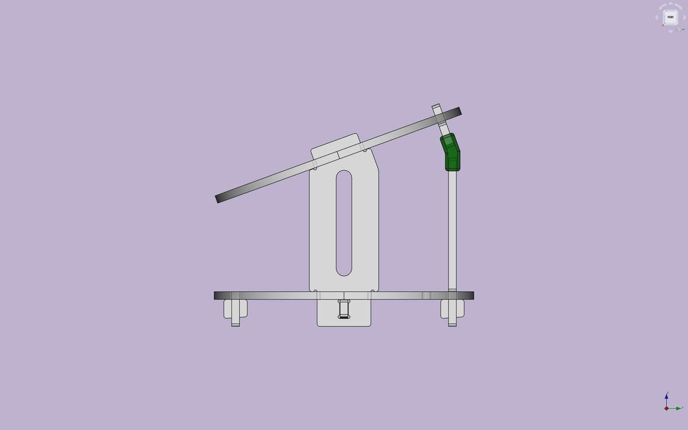
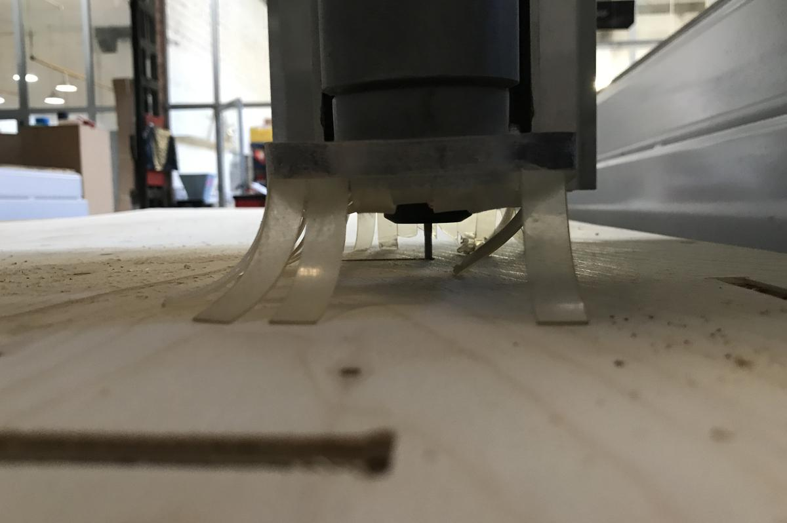
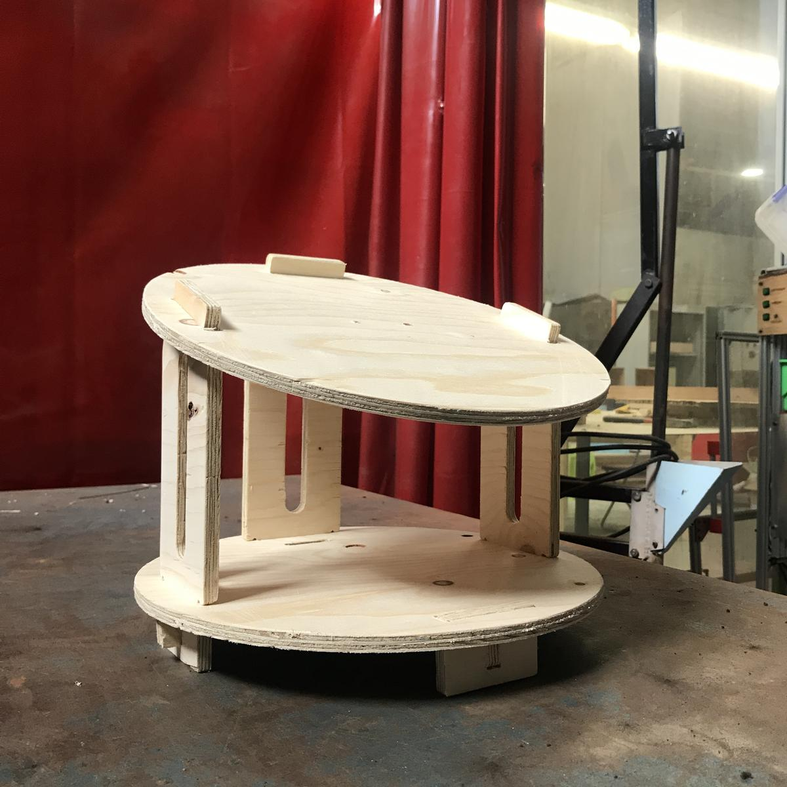
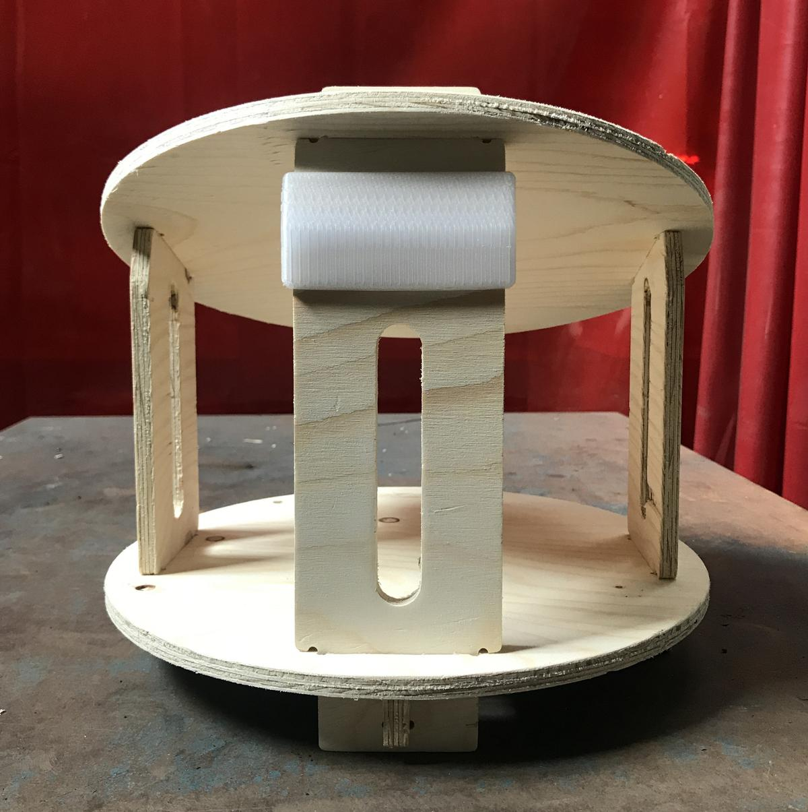

The structure was designed with [Freecad](https://www.freecadweb.org/) and made to be milled with a CNC machine on a 9mm thick plywood panel. The upper disk supports the inflatable part and the lower disk supports the electronics. A 3D printed part ensures the desired angle of the structure.

# Design

The keys, the parts that lock the structure, are not straight but have a small angle to be able to drive them into the other part.

# Fabrication

## Prototype

I wanted to see my project out of my computer to make sure I was designing it with good proportions before I cut it with the CNC on a wood board. To do this, I lasercut a tiny prototype on cardboard.

Cardboard is the cheapest and most environmentally friendly material available in Fab Labs, making it the best material for prototyping.

That step gave me the "green light" to fabricate my project real size.

## Real size

# Result

# Files

- Freecad design file - [structure_FAB.FCStd](file:structure_FAB.FCStd)
- Structure DXF file - [structure_dogbones.dxf](file:structure_dogbones.dxf)
- Connector STL file - [connector.stl](file:connector.stl)