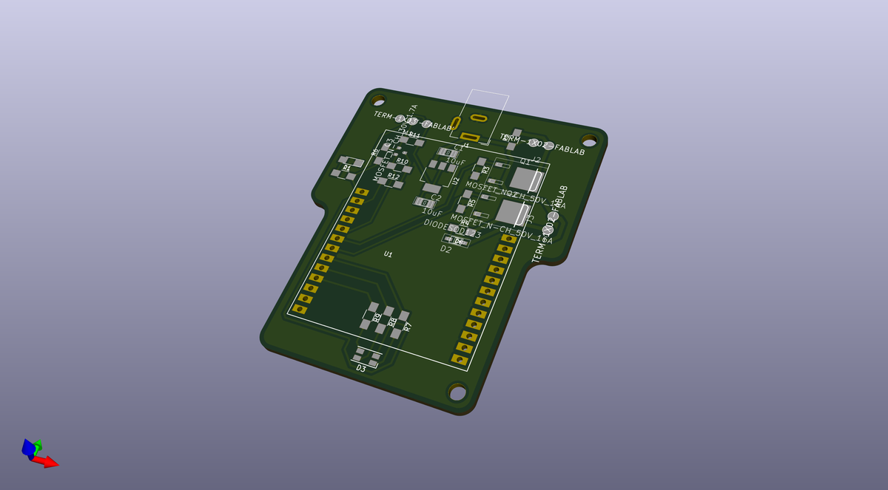
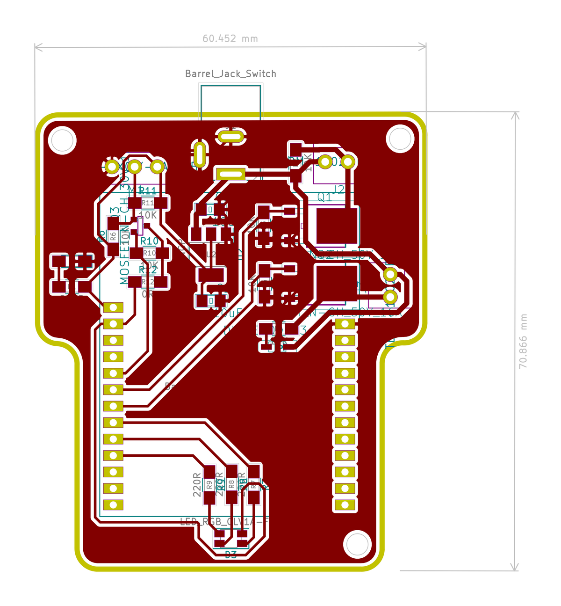
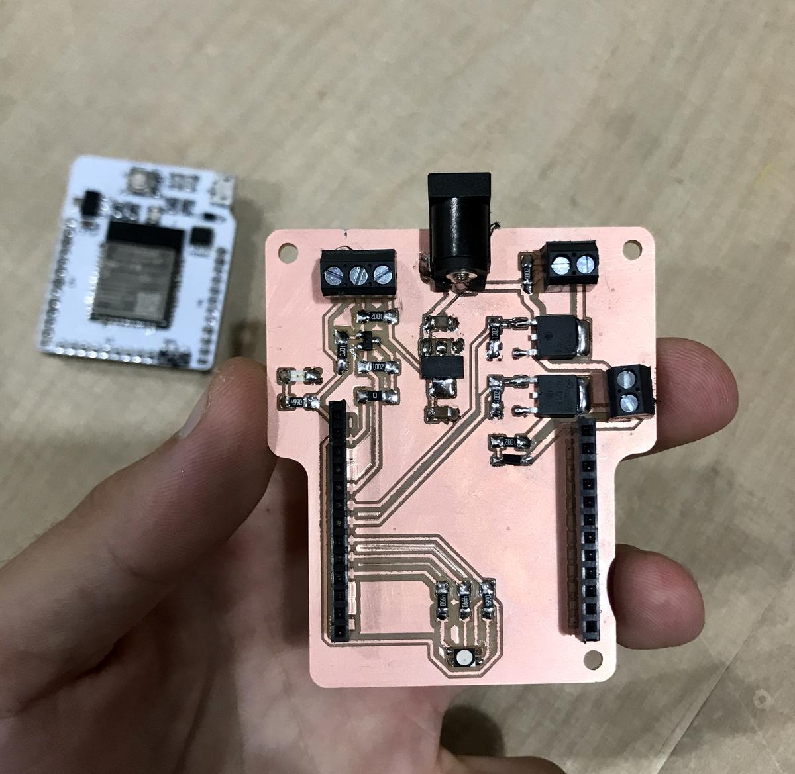
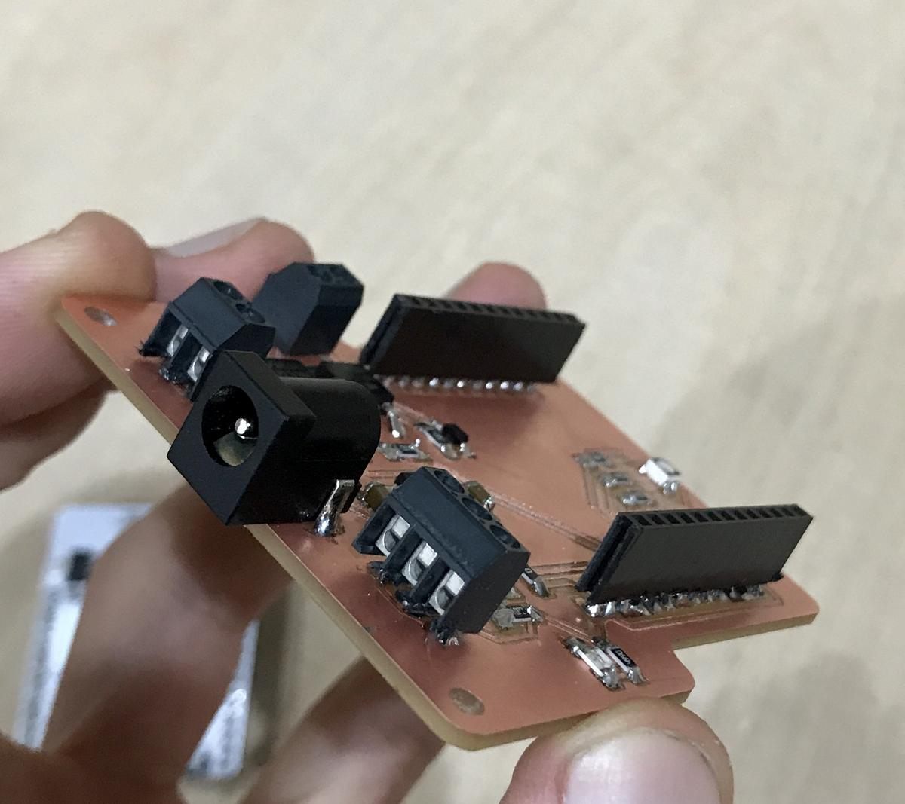
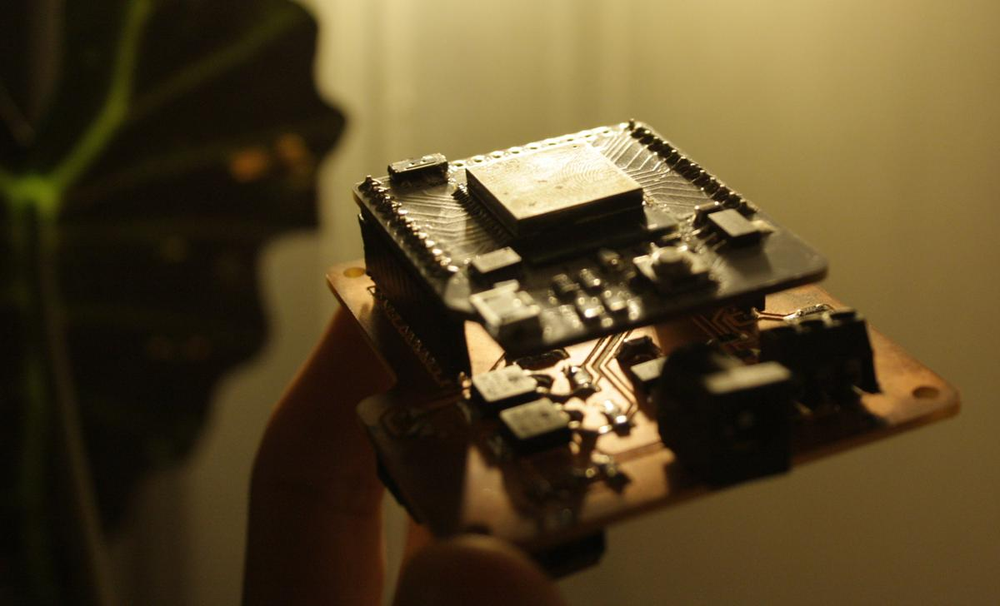

The electronic part of the incubator must remain as simple as possible, to offer the possibility of being understood and modified by others. I don't want to lock the users in a device they don't understand.

It is built as an extra board that comes with a Barduino, allowing it to operate with two 12V outputs and one 5V input.

# Components

## Barduino

A [Barduino](https://gitlab.com/fablabbcn-projects/electronics/barduino), an ESP32 development board made in Barcelona, is used as the brain. This allows me to use a Wifi compatible board with a functional USB connection without having to do it (again) by myself. Moreover, it allows me to design a shield (something I've never done before) and to participate in an open-source project that I'd like to support.

## Humidity and temperature sensor

A [DHT11](https://www.adafruit.com/product/386) humidity and temperature sensor provides information on what is happening in the incubator. I use the DHT11 mainly because it is available in the laboratory. I am not entirely satisfied with this sensor because it is slow and sometimes skips some data. It is clearly sufficient for this project because I don't need a high efficiency sensor, but it is not ideal.

## Heating pad

A [heating pad](https://www.adafruit.com/product/1481) ([datasheet](https://cdn-shop.adafruit.com/datasheets/Ultra+Heating+Fabric.pdf)) is used to warm up the temperature inside the incubator. When supplied with 12V, it can reach up to 110°C. It is not necessary to reach this temperature, but it will allow us to have the desired temperature even if the incubator is not fully insulated.

## Fan

A [12V fan](https://www.sparkfun.com/products/16034) is used to distribute the heat evenly inside the incubator, or to try to cool it down in case it gets too hot (which could easily happen in the Barcelona sun).

## RGB LED

An RGB LED is used to communicate basic information to the user. Does the incubator heat or cool? Has it reached the desired temperature? etc.

# Schematics

## Interesting points

- A [voltage regulator](https://www.onsemi.com/pub/Collateral/NCP1117-D.PDF) is used to convert 12V to 5V (which is used by the sensor and the Barduino)
- A small [mosfet](https://www.onsemi.com/pub/Collateral/NDS355AN-D.PDF) and two resistors are used as a level shifter to convert 3.3V to 5V on the line to the sensor, so it only *speaks* in 5V.
- Big [mosfets](https://www.onsemi.com/pub/Collateral/RFD16N05LSM-D.PDF) are used on the 12V lines to let the current flow to the two outputs, the fan and the heating pad.
- A diode is used on the fan line to ensure that the current won't fly back on the unwanted direction when the motor stops, thus protecting the circuit.
- A OΩ resistor has been added to act as a jumper to facilitate the PCB design.

## known errors

- the GPIO 34, 35, 36, 39 on the ESP32 are only inputs ([source](https://randomnerdtutorials.com/esp32-pinout-reference-gpios/)) and therefore can't be used for the fan or the heating pad. I discovered this only after the fabrication, I had to add an extra cable from an empty pin to the heating pad line (where was the error). Good to know for next time.

# PCB design

# Fabrication

## Incubator shield

The [SRM-20](https://www.rolanddga.com/products/3d/srm-20-small-milling-machine) milling machine wasn't properly calibrated when I used it because it had just received a new motor. The quality of my milling is therefore not the best, but after a close check with a multimeter, I can confirm that all the tracks are correctly connected.

## Barduino

The files to make the barduino can be found on its gitlab [repository](https://gitlab.com/fablabbcn-projects/electronics/barduino/-/tree/master/barduino-microusb-2.2).

Fab Lab Barcelona ordered several PCBs from their PCB design in order to speed up the production of the Barduino (which is used in various projects). Only the assembly, the soldering of the components, is necessary to make it work.

