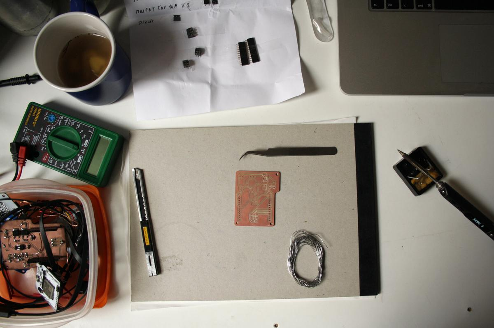

This is the continuation of [the electronics of the v0.1](incubator-v0-1-electronics.html).

In the previous version I had some problems with the ESP32 pins I was using. The one I had chosen for the heating pad could not be used as an output and the one I had chosen for the DHT11 sensor could not read values for any reason. I found out which pins to use after a session of testing all the pins and whether or not they could meet my needs.

Also, during my tests, I realised that the DHT11 sensor doesn't really need 5V to work, even though I thought it would be better/safe to use it this way. This means that I can remove some components from the PCB (the level shifter that converted 3.3V to 5V), which simplified the PCB design.

# Schematics

# PCB design

## Robustness and therefore longevity

This time, I decided to solder some components on the back of the PCB, as this will be easier to solder and will ensure the robustness and therefore the longevity of the design.

The components that will be soldered on the back are the Barduino (header), the barrel jack, the terminals (heating pad, fan, DHT11 sensor). To ensure the circuit connectivity, I have inverted the footprint of the Barduino and the barrel jack (I don't have to do this for the terminals as I will simply invert the cables).

# Fabrication and soldering

I fabricated this board at the Fab Lab Barcelona using a Roland SRM-20 milling machine. Then I took it home to solder it quietly with a good cup of tea.

## Little mistake

While making the schematics, I called the 3.3 volt line "3V3" and "3.3V", which produced a disconnected line. I had to solder a resistor tab between the 3.3V and one of the DHT11 sensor pads to make it work. I need to correct this in the next version.

# Result

The prototype now works perfectly. The DHT11 sensor measures the temperature and humidity inside the box, the heating pad heats to maintain the temperature at the desired value and the fan circulates the air to distribute the heat properly.

# Files

- Design and fabrication files: [incubator-electronics-v0-2.zip](file:incubator-electronics-v0-2.zip)

