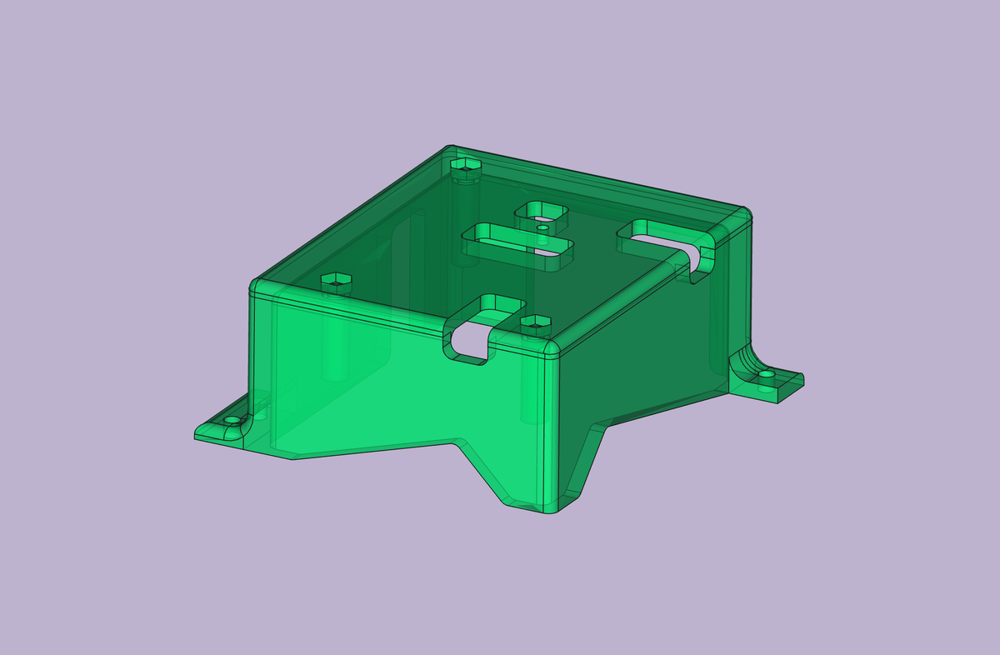
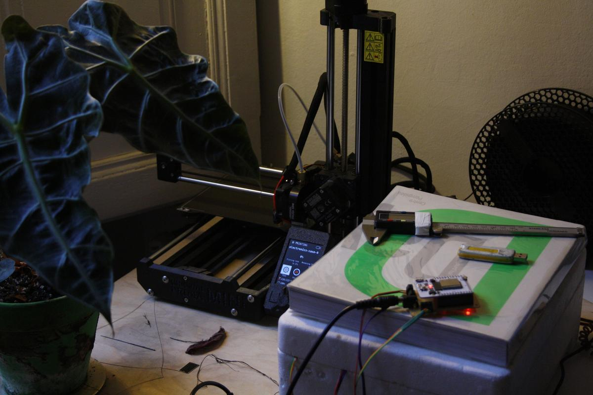
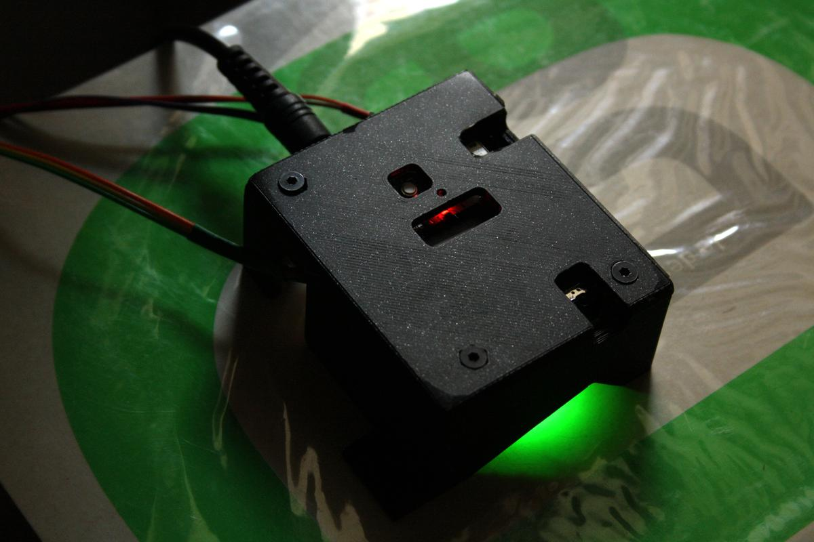
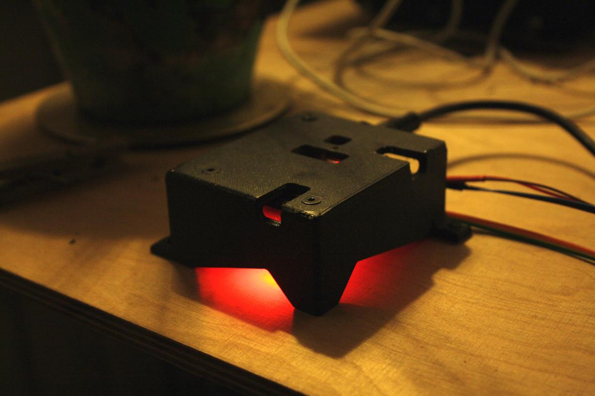
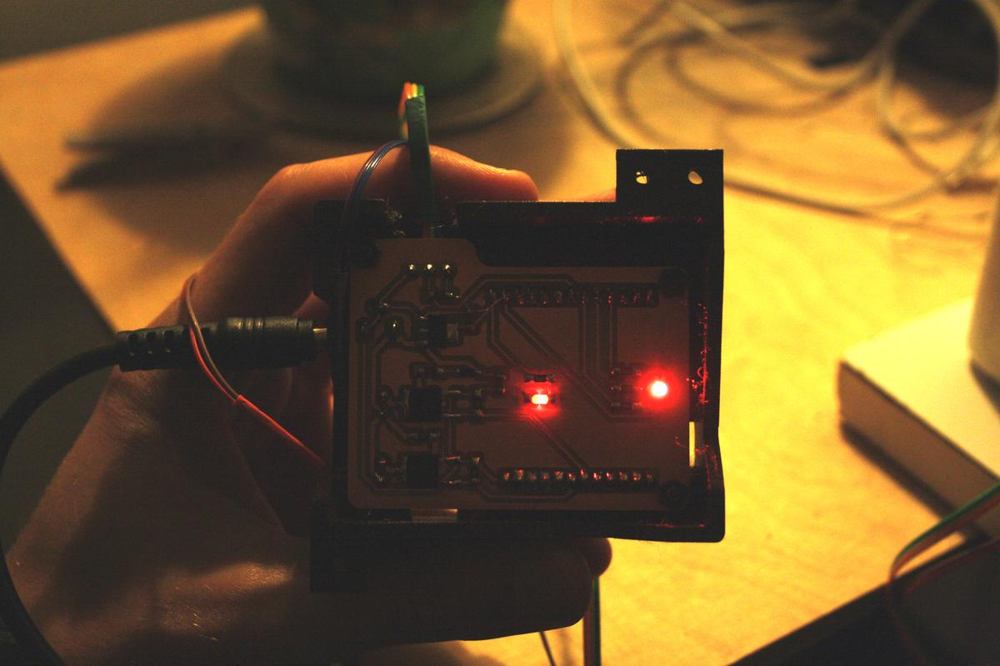

Now that the [electronics](incubator-v0-2-electronics.html) is working, I need to protect it a little to avoid mishandling that could damage it. To do this, I will design a case which will then be printed in 3D.

# Design

The main idea of this design is to have all the functions accessible while having a light reflection that communicates the state of the incubator (if it is heating up, or if it has reached the desired temperature, or if it is cooling down).

TODO: Add technical details

## What must remain accessible

- the USB port
- Barrel jack
- Reset button
- Programmer switch
- Terminals (3)
- ESP32 antenna

## A way to fix it

Also, we need to find a way to fix the electronics in the case and then the case in the incubator, for this I will use M3 bolts and nuts. I downloaded a [3D model](https://grabcad.com/library/m3-hex-nut-1) of the M3 nut that I incorporated into my design.

## From KiCAD to FreeCAD

Both [KiCAD](https://www.kicad.org/) (Electronics design) and [FreeCAD](https://www.freecadweb.org/) (2D and 3D parametric modeler) are open-source and work hand in hand in order to facilitate the use of one after the other. FreeCAD's [KicadStepUp workbench](https://wiki.freecadweb.org/KicadStepUp_Workbench) allows to import a 3D model from a PCB designed in KiCAD to start designing from it.

## Views

# Fabrication

I printed this project at home using our new Mini Prusa 3D printer. I'm always amazed at the final quality of this printer. The only thing I have to adjust is the way I make my supports. They always marked my prints badly, which reduces the quality. The print was done in ~4 hours.

# Result

It went so well. The reflection of the light is as I had imagined and my measurements were good! Well, almost good, because I had to cut my USB cable to fit my design.

