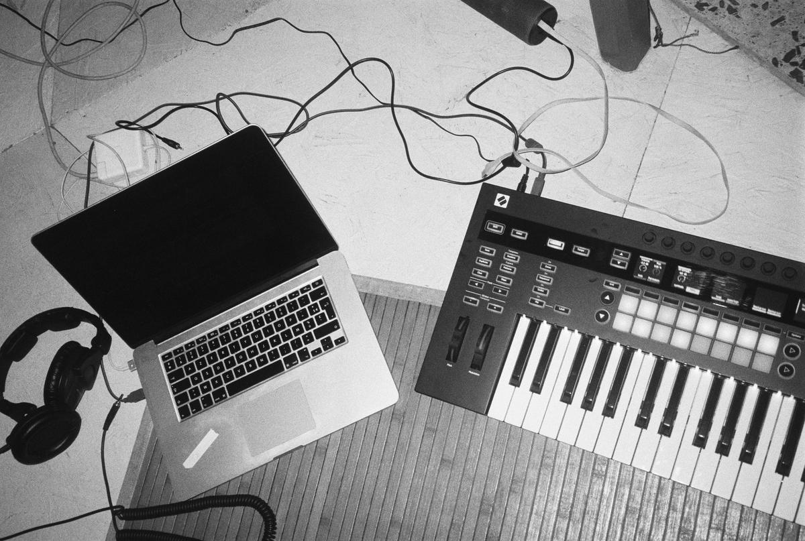
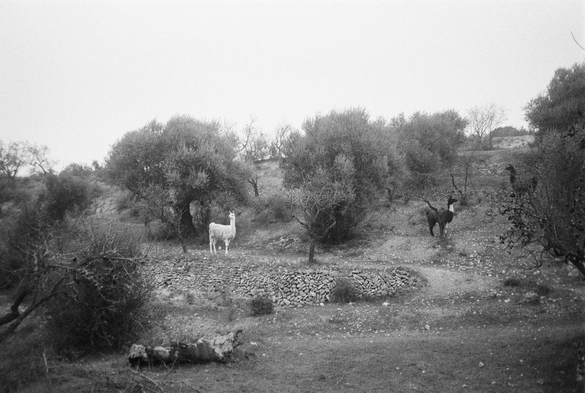
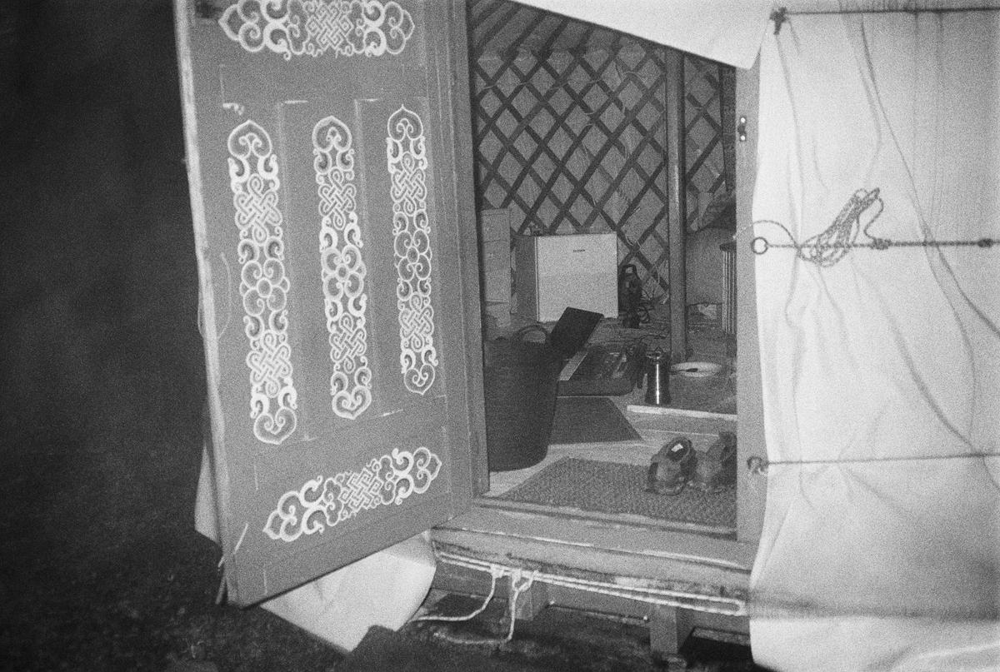
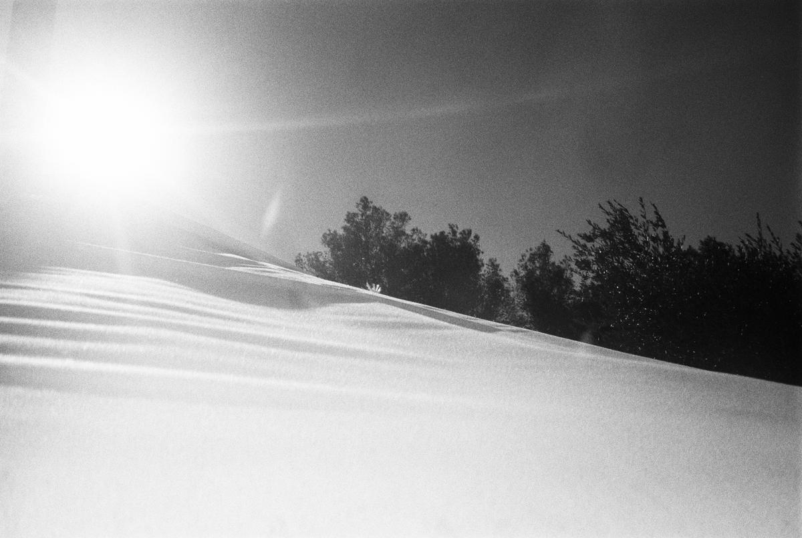
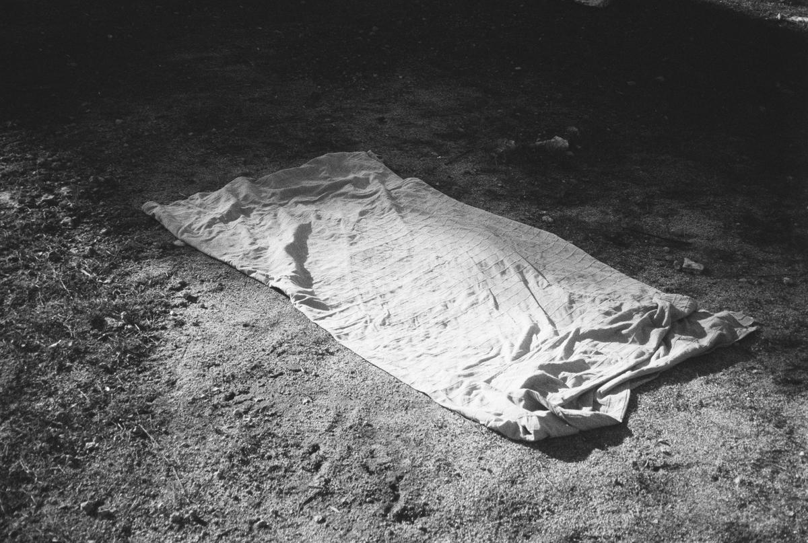
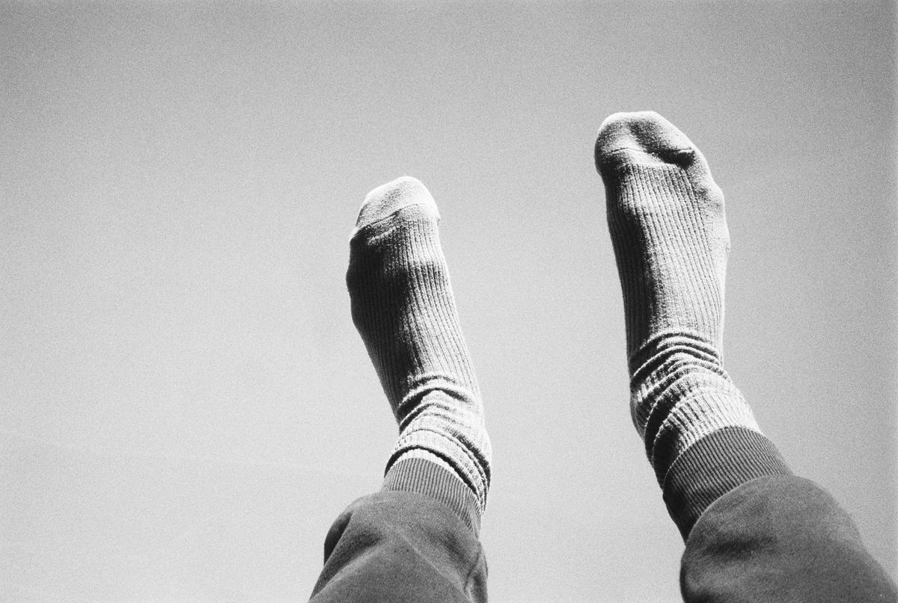
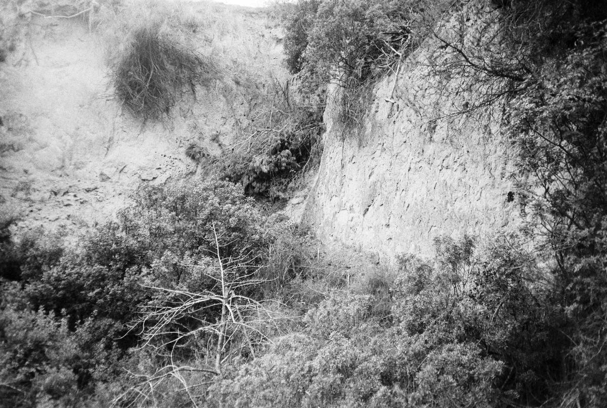
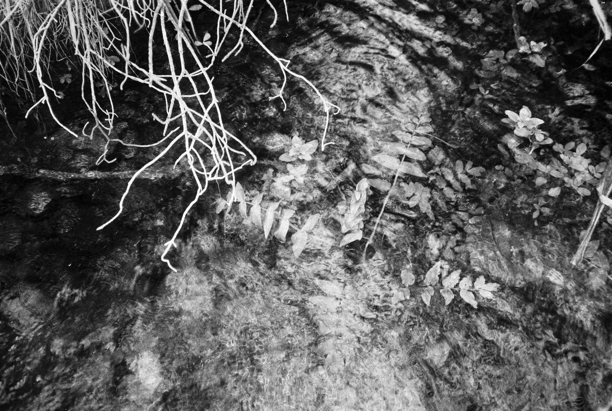

At the end of December 2020, I felt the need to create a musical project. One of my first. I went for several days, alone, to a yurt surrounded by llamas located in the south of Catalonia, Spain.  I spent my days walking, cycling, practicing yoga and meditation. And my nights composing this album.

<iframe src="https://bandcamp.com/EmbeddedPlayer/album=1330270076/size=large/bgcol=ffffff/linkcol=333333/artwork=none/transparent=true/" style="border: 0; top: 0; left: 0; width: 100%; height: 100%; position: absolute;" allowfullscreen allow="encrypted-media"></iframe>

*Alien Jazz* is available on [Bandcamp](https://focus404.bandcamp.com/album/alien-jazz) and [Soundcloud](https://soundcloud.com/focus404/sets/alien-jazz).

