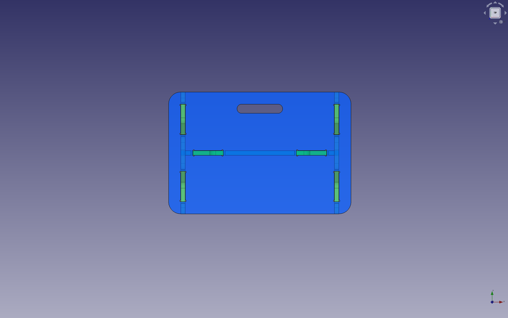
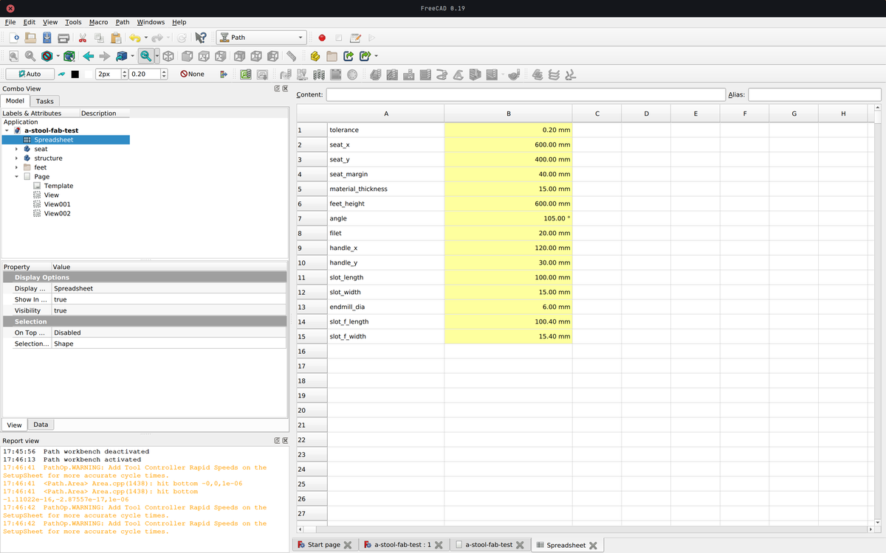
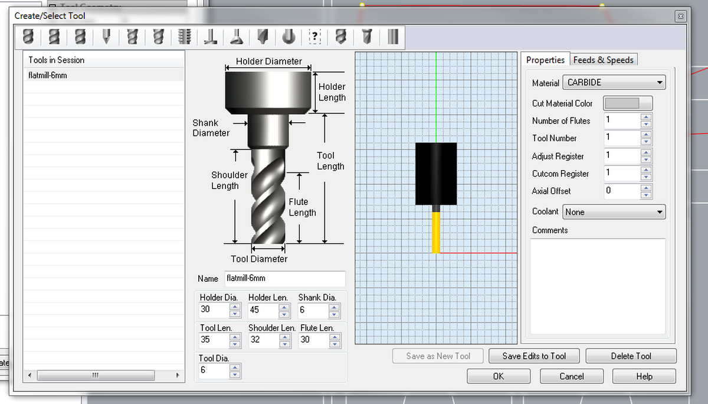
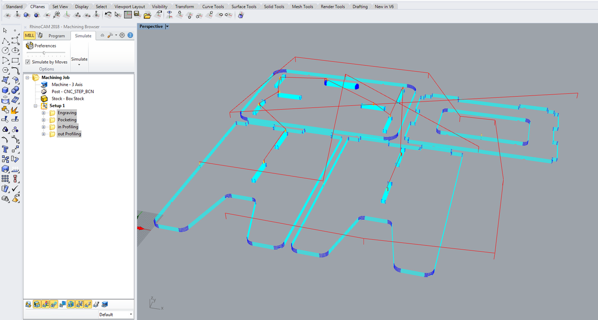

I wanted to have a stool/bench/table for my apartment, a kind of furniture that can be different things because of its dimensions. So I designed and fabricated it using the large CNC at Fab Lab Barcelona.

I designed it with parametric values. This process can be useful for everyone, to adapt the furnitures (or anything else) to their needs and the context in which it will be used.

# Design

I first designed this project on paper and then in [Freecad](https://www.freecadweb.org/), my favorite open-source software for 3D modeling.

The stool/bench/table consists of a seat, two legs and a stretcher.

## Parametric values

I used parametric values in order to easily modify values such as the lengths of the seat, the height of the legs, the thickness of the material, the endmill diameter I will use, the length of the slots, etc.

Once the document is well organised and the values in the part design workbench call up values from the datasheet, changing the values automatically changes the rest. This allows me to design without knowing everything in advance, such as the diameter of the milling cutter that will be used to mill the project, and above all it allows the design to be adapted quickly and almost frictionlessly to new constraints.

## Preparing for production

### Tolerance

It is strongly recommended to take a tolerance value into account when working with a CNC machine. This is because the machine will not produce a perfect result and if the cuts are too tight, there is a good chance that it will be almost impossible to put the project together.

In this case I used a tolerance value of `0.2 mm`. This means that there is an extra `0.1 mm` on each side of the cut to make sure that the parts fit together.

Update: the tolerance value I used wasn't enough, I had to sand the mortises in order to join the different elements together.

### Dogbones

Right angles are not accessible by the endmills, which will produce an undesirable result.

To avoid this, it is common practice to create dog bone shapes by adding holes the size of the endmill in the right angles. The space left by the cut will then correspond to the piece that is supposed to fit into it.

### Export

When the different parts are well designed, take into account the tolerance of the CNC and have dogbones shapes to ensure that the actual measurements will be as expected, export all parts in a technical drawing sheet at the correct scale (1:1). This sheet should be exported as a `.dxf` file and then imported into RhinoCAM.

# Toolpaths

## File import

- Import the `.dxf` file into Rhino
- `Join` the different paths together and `Group` them to be sure that no lines will float alone

## Box stock

- Create a rectangle the size of your material `2,400 mm x 1,250 mm`
- `Stock > Box stock` and select the rectangle
- Select `Height`
- Corner coordinates `0, 0, 0`
- Dimensions `2,400 x 1,250 x 15`

## Screw marks

- Copy the material rectangle and offset it by `20mm`
- Create `Points` along the offset line to fix the material
- Add more `Points` around the critical part that could move during the process. If it is needed to add a screw inside a pocket, make sure to place two of them to avoid any rotational movement.

## Tool

- Create a new `Tool`
  - Flat mill downcut
  - Number of flutes: `1`
  - Tool diameter: `6 mm`
  - Tool length: `35 mm`
  - Shoulder length: `32 mm`
  - Flute length: `30 mm`
  - Feeds & Speeds
      - Speed: `18000 RPM` (the machine can operate between 18000 and 24000 RPM, but the minimum is enough)
      - Cut speed: `5500`
      - Plunge, approach , engage, retract, departure: `2500` (cut speed/2)
      - Transfer: `Use rapid` (and set 10000 for RhinoCAM simulation)
- `Save` the new tool

To calculate the `Cut speed` value, check the chipload value of the material (for plywood, using a 6mm endmill, range is `.011″-.013″`, according to this [calculator](https://gdptooling.com/chipload-calc/#)). Then RPM * number of flutes * minimum value * 25.4 (in to cm) = minimum cut speed. Then do the same for the maximum value. Finally, use a value in the middle to ensure the happiness of the machine.

## Engraving, pocketing, profiling

Do each step on a different layer.

- Control geometry: select the appropriate zones and `generate`
- Tool: select the previoulsy created tool
- Feeds and speeds: Load from tool
- Clearance Plane: Stock Max Z + Dist: `20 mm` for the screws (this will prevent the tool from scratching the material, if it's bent, during its movements) , then `10 mm` for the rest
- Cut Parameters:
  - Tolerance: `0.03 mm` for the screws then `0.01 mm` for the rest
  - Stock: `0`
  - Cut direction: `Climb (Down cut)`
  - Start Point: `Inside` or `Outside` depending on the design
  - Stepover Distance: `25 %`
- Cut levels
  - Total Cut Depth: `3` for the screws, then `15.5` (material thickness + margin) for the rest
  - Rough Depth Cut: `3` (3 mm on each layer, we don't want to force the tool)
- Entry/Exit: `None` and `None`, this is not needed for wood'()
- Advanced Cut Parameters (for the profiling)
  - Bridges: `Rectangular`
  - Bidge Height: `4`
  - Bidge Length: `4`
  - Number of brigdes: Depends on the design
- Sorting: `Minimum Distance Sort`
- `Generate`

## Export to G-code

Two files must be exported. The first one contains the screw data, which we will run first. Then all the other operations (pocketing, inner profiling, outer profiling) on the second file, which we will launch once the material is screwed to the machine bed.

- Right click on a operation > `Post`
- File name: something like `01-screws-6mm` or `02-6mm`
- Save as type: `*.nc`
- Current post: `CNC_STEP_BCN` (which contains all the information about the specific machine I will be using)

# Fabrication

1. Mount the material on the machine bed
2. Mount the desired endmill and tighten it properly
3. In the machine software (KinetiC-NC) go to Jog/Setup, move to zero position
4. Set the Z position using the mechanical button: put the large button under the endmill and set the Z, the sotftware will know what the correct Z value is
5. Run the first file to obtain the srew positions on the material
6. Screw the material to the machine bed
7. Re-set the Z because the material should be lower than before now that it is properly fixed
8. Run the second file containing all the other instructions
9. Cut the brigdes using an hammer and a chisel
10. Unscrew the screws
11. Sand the egdes of the pieces to obtain a nice result

<video><source src="cnc-milling-web.mp4"></video>

# Result

# Conclusion

It's really nice to design something knowing how it will be made afterwards. Designing with constraints, understanding the material and taking into account all the little details that can make a difference. That's part of the reason I'm doing this Fab Academy. CNC is a wonderful machine that can produce all kinds of results, and I'm looking forward to discovering them all.

At first it was intimidating. The machine is powerful and can be harmful if not used properly and there is a wide range of settings to know and understand to produce the right instructions for the machine (G-code). But once all this is demystified, all that remains is fun and new possibilities.

# Files

- Stool v1, Freecad design file -> [a-stool.FCStd](file:a-stool.FCStd)
- Stool v1, Freecad fabrication file -> [a-stool-fab.FCStd](file:a-stool-fab.FCStd)
- Stool v1, DXF export -> [a-stool-fab.dxf](file:a-stool-fab.dxf)
- Stool v1, RhinoCAM file -> [stool-v1-a-stool-fab.3dm](file:stool-v1-a-stool-fab.3dm)
- Stool v1, g-code step 1 -> [stool-v1-01-screws-6mm.nc](stool-v1-01-screws-6mm.nc)
- Stool v1, g-code step 2 -> [stool-v1-02-6mm.nc](stool-v1-02-6mm.nc)
