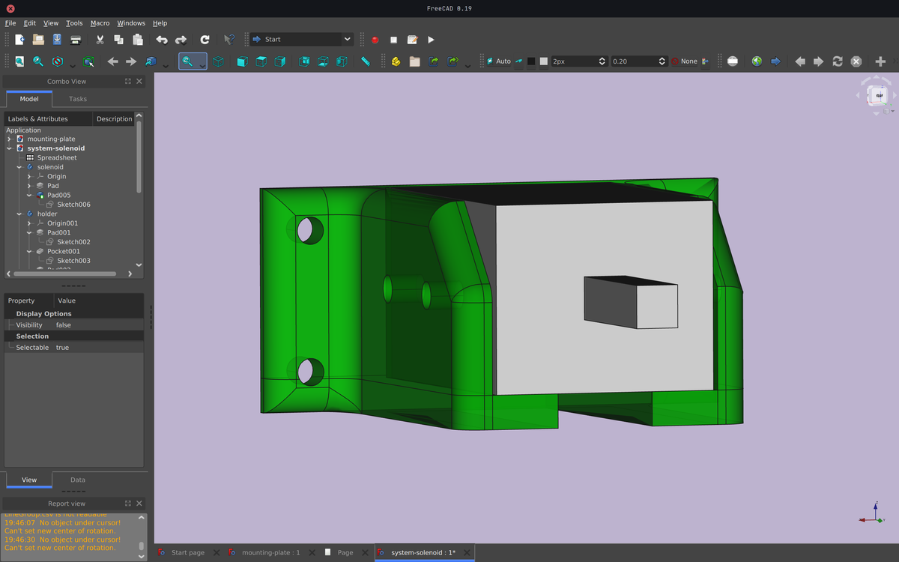

# Mounting plate

I designed and laser-cut a mounting plate made of acrylic (`10 mm`) with the imprints of our elements (NEMA17 stepper motor and solenoid) in order to be able to fix our elements to the structure, and thus make it move when the stepper motor is actuated.

# Solenoid holder

To fix the solenoid, which will then be used to push the ball forward, I designed an holder that we could screw onto our mounting plate.

# Files

- Solenoid holder (Freecad design file): [system-solenoid.FCStd](file:system-solenoid.FCStd)
- Solenoid holder (Fabrication file): [solenoid-holder-2.stl](file:solenoid-holder-2.stl)
- Mounting plate (Freecad design file): [mounting-plate.FCStd](file:mounting-plate.FCStd)
- - Mounting plate (Fabrication file): [mounting-plate.dxf](file:mounting-plate.dxf)