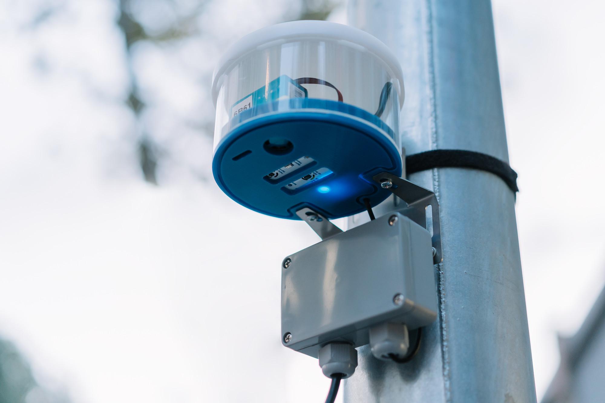

While I'm updating this website to better reflect my current practice, let me briefly explain what is in the making at the moment.

## Domingo Club

I dedicate most of my time and energy to my project [Domingo Club](https://domingoclub.com). It's a project that we launched a year ago with my partner [Maud Bausier](https://maudbausier.com).

We promote fermented plant-based protein and build tools so that everyone can make them at home for the benefit of our lives and our planet.

It all started with a growing desire to get closer to natural processes and microorganisms, and some prototype incubators, see [[incubator-v0-1]] and [[incubator-v0-2]].

## Fab Lab Barcelona

I work partly at Fab Lab Barcelona in a project called [Smart Citizen](https://smartcitizen.me/). We design and develop environmental sensors that publish on an open platform that can be used by anyone. To sense air quality, water quality, noise and light pollution, etc.

## Readings on the shelf

- Entangled Life, Merlin Sheldrake
- The Art Of Fermentation, Sandor Katz
- Why We Sleep, Matthew Walker
- How To Do Nothing, Jenny Odell