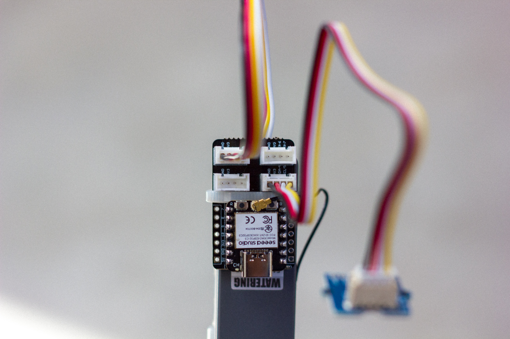
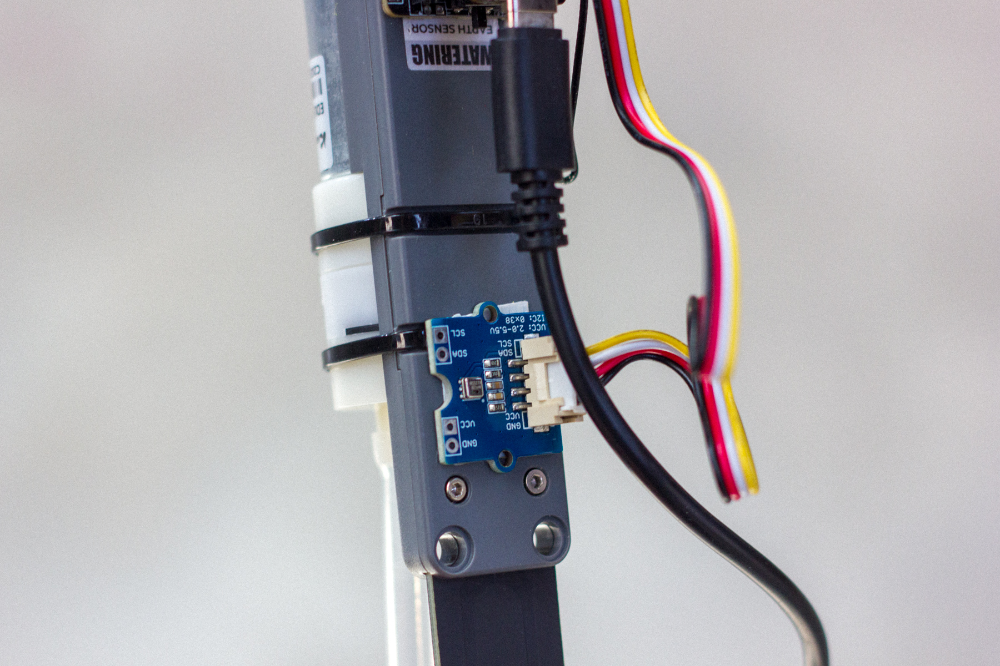
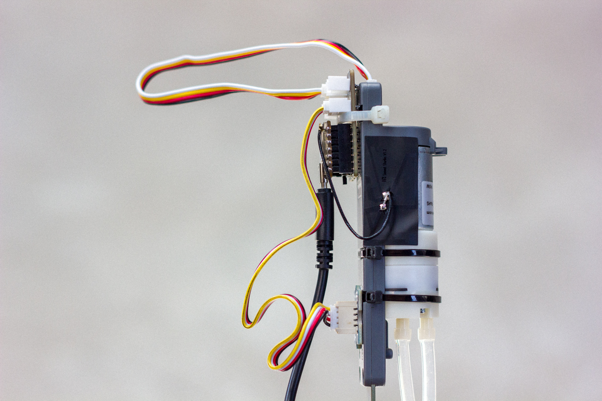
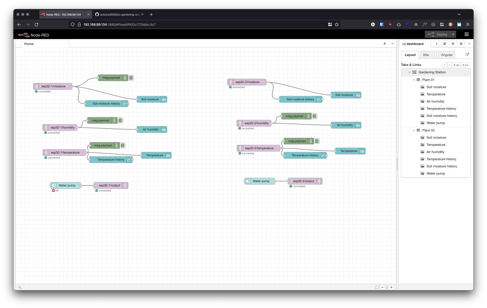

A smart device connected to a plant, which measures the soil moisture level, the ambient temperature and humidity and based on the data collected it waters the plant to meet its needs. The data is published online and a web interface allows direct interaction with the gardening station.

>  This project is open-source and designed to be built and deconstructed, learned and re-appropriated.

[See the repository on Github](button:https://github.com/antoine3000/smart-gardening-station)

## Hardware

### Components

- Seeed Studio XIAO ESP32C3
- Grove Shield for Seeed Studio XIAO
- Watering Unit with Mositure Sensor and Pump
- AHT20 Temperature and Humidity Sensor
- iot-gardening-station-cap.stl

### Assembly instructions

1. Break the XIAO ESP32 at the divider to reduce its size
2. Attach the XIAO ESP32 to the top of the watering unit with a plastic collar
3. Connect the antenna to the XIAO ESP32 and stick it on the side of the water unit
4. Connect the sensor to the board with a Grove cable to pin 4 and 5
4. Connect the water unit to the board with a Grove cable to pin 1 and 2
5. Tape the sensor to the base of the watering unit using double-sided tape
6. 3D print the cap and place it on the unit to cover everything

## Software

### Arduino

Arduino allows us to program our board so that it acts as desired. Create a new arduino project and paste the code from `iot-gardening-station-arduino.ino` into it. It will most likely be necessary to install the few libraries used.

### Node-red

An instance of Node-red allows us to connect our devices to a dashboard. The easiest way is to have Node-red installed on a Raspberry Pi. Or on another computer that can stay on. Import the code from [iot-gardening-station-node-red.json](iot-gardening-station-node-red.json) into the Node-red dashboard to configure the dashboard and its connections as desired.

Nodes: [http://127.0.0.1:1880/](http://127.0.0.1:1880/)
Interface: [http://127.0.0.1:1880/ui](http://127.0.0.1:1880/ui)

## Links and references

- [Getting Started with Seeed Studio XIAO ESP32C3](https://wiki.seeedstudio.com/XIAO_ESP32C3_Getting_Started/)
- [Grove - AHT20 I2C Industrial Grade Temperature&Humidity Sensor](https://wiki.seeedstudio.com/Grove-AHT20-I2C-Industrial-Grade-Temperature&Humidity-Sensor/)
- [Arduino IDE - Importing a .zip Library](https://docs.arduino.cc/software/ide-v1/tutorials/installing-libraries)
- [Raspberry Pi Install](https://www.raspberrypi.com/software/)
- [Raspberry Pi Remote Access](https://www.raspberrypi.com/documentation/computers/remote-access.html#installing-vnc-on-raspberry-pi)
- [Running Node Red on the RPI](https://nodered.org/docs/getting-started/raspberrypi)
- [Configuring Node Red](https://microcontrollerslab.com/install-node-red-raspberry-pi/)
- [MQTT Publish Multiple Sensors to Node Red](https://microcontrollerslab.com/esp32-mqtt-publish-multiple-sensor-readings-node-red/)
- [ESP32 MQTT – Publish and Subscribe with Arduino IDE](https://randomnerdtutorials.com/esp32-mqtt-publish-subscribe-arduino-ide/)
- [Setting up a Mosquitto-MQTT Broker on a Raspberry Pi](https://gallaugher.com/setting-up-a-mosquitto-mqtt-broker-on-a-raspberry-pi/)
- [Grove Shield Pinout](https://wiki.seeedstudio.com/Grove-Shield-for-Seeeduino-XIAO-embedded-battery-management-chip/#hardware-connection)
- [Watering Unit example](https://github.com/m5stack/M5Stack/blob/master/examples/Unit/WATERING/WATERING.ino)
- [Remote Access with remote.it](https://medium.com/@nikhilagarwal1701/how-to-connect-to-your-raspberry-pi-over-different-network-from-your-device-b650cb372ea)

## License

The code is under the [MIT LICENSE](LICENSE), the assets are [BY-NC-SA 4.0](LICENSE.by-nc-sa-4.0.md).

